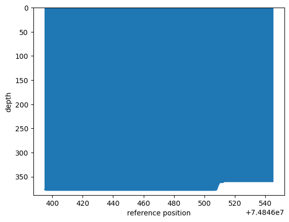
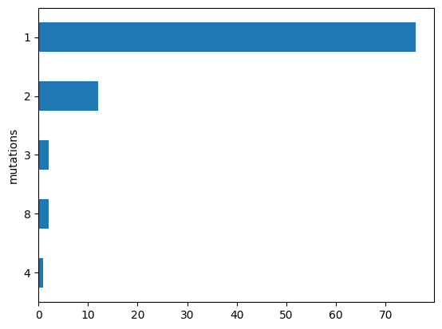

# ``dseq`` <a href="#"></a>

Deep sequencing analysis in dataframes
<!-- [![Contributors][contributors-shield]][contributors-url]
[![Forks][forks-shield]][forks-url]
[![Stargazers][stars-shield]][stars-url] -->
<a href="">[
](https://pypi.org/project/dseq)</a>
<a href="">[](https://github.com/rraadd88/dseq/actions/workflows/test.yaml)</a>
<a href="">[](https://github.com/rraadd88/dseq/issues)</a>
<a href="">[](https://pepy.tech/project/dseq)</a>
<a href="">[](https://github.com/rraadd88/dseq/blob/master/LICENSE)</a>

<!-- WARNING: THIS FILE WAS AUTOGENERATED! DO NOT EDIT! -->

## Install

``` sh
pip install dseq
```

## How to use

### Read the bam file as a pandas dataframe

``` python
from dseq.tools import to_df
df=to_df(
    bam_path='inputs/test.bam', # path to the bam file
    contig='14',                # i.e. reference name/ target
    start=74846395,             # start position
    end=74846545,               # end position
    verbose=True,               # verbose
)
df.head(1)
```

<div>


|     | query id                                          | CIGAR | read position | reference position | reference | read |
|-----|---------------------------------------------------|-------|---------------|--------------------|-----------|------|
| 0   | M04377:211:000000000-D637H:1:1101:7912:5949::u... | 151M  | 0.0           | 74846395.0         | C         | C    |

</div>

## How to calculate

### Coverage per position (`QC`)

``` python
data=df.dseq.get_coverage()
data.head(1)
```

<div>


|     | reference position | reference | depth |
|-----|--------------------|-----------|-------|
| 0   | 74846395.0         | C         | 377   |

</div>

``` python
## plot
_=data.plot.area(
    x='reference position',
    y='depth',
    ylabel='depth',
    ylim=(data['depth'].max()+10,0),
    legend=False,
)
```



### Number of reads per mutations (`QC`)

``` python
data=df.dseq.get_counts_per_mutation()
data.head(1)
```

    4    1
    dtype: int64

``` python
## plot
_=data.plot.barh(xlabel='mutations',ylabel='reads')
```



### Read depth per nucleotide mutations

``` python
data=df.dseq.get_counts_per_nt_mutation()
data.head(1)
```

<div>


|     | reference position | reference | read | depth |
|-----|--------------------|-----------|------|-------|
| 0   | 74846395.0         | C         | C    | NaN   |

</div>

#### Mutation map

``` python
data.dseq.get_map(value='depth',aggfunc='sum')
```


| reference position | 74846395.0 | 74846396.0 | 74846397.0 | 74846398.0 | 74846399.0 | 74846400.0 | 74846401.0 | 74846402.0 | 74846403.0 | 74846404.0 | 74846405.0 | 74846406.0 | 74846407.0 | 74846408.0 | 74846409.0 | 74846410.0 | 74846411.0 | 74846412.0 | 74846413.0 | 74846414.0 | 74846415.0 | 74846416.0 | 74846417.0 | 74846418.0 | 74846419.0 | 74846420.0 | 74846421.0 | 74846422.0 | 74846423.0 | 74846424.0 | 74846425.0 | 74846426.0 | 74846427.0 | 74846428.0 | 74846429.0 | 74846430.0 | 74846431.0 | 74846432.0 | 74846433.0 | 74846434.0 | 74846435.0 | 74846436.0 | 74846437.0 | 74846438.0 | 74846439.0 | 74846440.0 | 74846441.0 | 74846442.0 | 74846443.0 | 74846444.0 | 74846445.0 | 74846446.0 | 74846447.0 | 74846448.0 | 74846449.0 | 74846450.0 | 74846451.0 | 74846452.0 | 74846453.0 | 74846454.0 | 74846455.0 | 74846456.0 | 74846457.0 | 74846458.0 | 74846459.0 | 74846460.0 | 74846461.0 | 74846462.0 | 74846463.0 | 74846464.0 | 74846465.0 | 74846466.0 | 74846467.0 | 74846468.0 | 74846469.0 | 74846470.0 | 74846471.0 | 74846472.0 | 74846473.0 | 74846474.0 | 74846475.0 | 74846476.0 | 74846477.0 | 74846478.0 | 74846479.0 | 74846480.0 | 74846481.0 | 74846482.0 | 74846483.0 | 74846484.0 | 74846485.0 | 74846486.0 | 74846487.0 | 74846488.0 | 74846489.0 | 74846490.0 | 74846491.0 | 74846492.0 | 74846493.0 | 74846494.0 | 74846495.0 | 74846496.0 | 74846497.0 | 74846498.0 | 74846499.0 | 74846500.0 | 74846501.0 | 74846502.0 | 74846503.0 | 74846504.0 | 74846505.0 | 74846506.0 | 74846507.0 | 74846508.0 | 74846509.0 | 74846510.0 | 74846511.0 | 74846512.0 | 74846513.0 | 74846514.0 | 74846515.0 | 74846516.0 | 74846517.0 | 74846518.0 | 74846519.0 | 74846520.0 | 74846521.0 | 74846522.0 | 74846523.0 | 74846524.0 | 74846525.0 | 74846526.0 | 74846527.0 | 74846528.0 | 74846529.0 | 74846530.0 | 74846531.0 | 74846532.0 | 74846533.0 | 74846534.0 | 74846535.0 | 74846536.0 | 74846537.0 | 74846538.0 | 74846539.0 | 74846540.0 | 74846541.0 | 74846542.0 | 74846543.0 | 74846544.0 | 74846545.0 |
|--------------------|------------|------------|------------|------------|------------|------------|------------|------------|------------|------------|------------|------------|------------|------------|------------|------------|------------|------------|------------|------------|------------|------------|------------|------------|------------|------------|------------|------------|------------|------------|------------|------------|------------|------------|------------|------------|------------|------------|------------|------------|------------|------------|------------|------------|------------|------------|------------|------------|------------|------------|------------|------------|------------|------------|------------|------------|------------|------------|------------|------------|------------|------------|------------|------------|------------|------------|------------|------------|------------|------------|------------|------------|------------|------------|------------|------------|------------|------------|------------|------------|------------|------------|------------|------------|------------|------------|------------|------------|------------|------------|------------|------------|------------|------------|------------|------------|------------|------------|------------|------------|------------|------------|------------|------------|------------|------------|------------|------------|------------|------------|------------|------------|------------|------------|------------|------------|------------|------------|------------|------------|------------|------------|------------|------------|------------|------------|------------|------------|------------|------------|------------|------------|------------|------------|------------|------------|------------|------------|------------|------------|------------|------------|------------|------------|------------|------------|------------|------------|------------|------------|------------|
| reference          | C          | C          | T          | A          | A          | G          | C          | C          | T          | T          | T          | A          | C          | G          | G          | T          | C          | A          | C          | T          | C          | A          | C          | C          | A          | C          | T          | C          | A          | C          | T          | C          | A          | C          | T          | C          | A          | C          | T          | C          | A          | C          | C          | C          | A          | G          | A          | G          | C          | A          | A          | C          | T          | T          | C          | C          | G          | G          | T          | C          | C          | T          | G          | C          | A          | A          | A          | C          | T          | C          | C          | C          | T          | T          | C          | A          | T          | A          | G          | T          | A          | A          | G          | T          | G          | C          | C          | C          | T          | A          | T          | A          | C          | A          | G          | G          | T          | G          | T          | A          | T          | A          | A          | T          | T          | A          | A          | A          | A          | A          | G          | A          | A          | A          | A          | T          | A          | T          | T          | T          | T          | A          | T          | A          | C          | C          | A          | T          | G          | G          | T          | T          | T          | T          | A          | C          | T          | G          | T          | A          | C          | C          | T          | C          | C          | A          | T          | G          | G          | T          | T          |
| read               |            |            |            |            |            |            |            |            |            |            |            |            |            |            |            |            |            |            |            |            |            |            |            |            |            |            |            |            |            |            |            |            |            |            |            |            |            |            |            |            |            |            |            |            |            |            |            |            |            |            |            |            |            |            |            |            |            |            |            |            |            |            |            |            |            |            |            |            |            |            |            |            |            |            |            |            |            |            |            |            |            |            |            |            |            |            |            |            |            |            |            |            |            |            |            |            |            |            |            |            |            |            |            |            |            |            |            |            |            |            |            |            |            |            |            |            |            |            |            |            |            |            |            |            |            |            |            |            |            |            |            |            |            |            |            |            |            |            |            |            |            |            |            |            |            |            |            |            |            |            |            |
| A                  | 0          | 0          | 0          | 0          | 0          | 0          | 0          | 0          | 0          | 0          | 0          | 0          | 0          | 0          | 0          | 0          | 0          | 0          | 0          | 0          | 0          | 0          | 0          | 0          | 0          | 0          | 0          | 1          | 0          | 0          | 1          | 0          | 0          | 0          | 0          | 0          | 0          | 0          | 0          | 0          | 0          | 0          | 0          | 0          | 0          | 0          | 0          | 1          | 0          | 0          | 0          | 0          | 0          | 0          | 0          | 0          | 1          | 0          | 0          | 0          | 0          | 0          | 0          | 0          | 0          | 0          | 0          | 0          | 0          | 0          | 0          | 0          | 0          | 0          | 0          | 0          | 1          | 0          | 1          | 0          | 0          | 0          | 0          | 0          | 0          | 0          | 0          | 0          | 0          | 0          | 0          | 0          | 0          | 0          | 0          | 0          | 0          | 0          | 0          | 0          | 0          | 0          | 0          | 0          | 0          | 0          | 0          | 0          | 0          | 0          | 0          | 0          | 0          | 0          | 0          | 0          | 0          | 0          | 0          | 0          | 0          | 0          | 0          | 0          | 0          | 0          | 0          | 0          | 0          | 2          | 0          | 0          | 0          | 0          | 0          | 0          | 0          | 0          | 0          | 0          | 0          | 1          | 0          | 0          | 0          | 0          | 0          | 0          | 1          | 0          | 0          |
| C                  | 0          | 0          | 2          | 0          | 0          | 0          | 0          | 0          | 1          | 0          | 0          | 0          | 0          | 0          | 0          | 1          | 0          | 2          | 0          | 1          | 0          | 2          | 0          | 0          | 0          | 0          | 2          | 0          | 0          | 0          | 1          | 0          | 0          | 0          | 1          | 0          | 0          | 0          | 3          | 0          | 0          | 0          | 0          | 0          | 0          | 0          | 0          | 0          | 0          | 0          | 0          | 0          | 0          | 0          | 0          | 0          | 0          | 0          | 1          | 0          | 0          | 3          | 0          | 0          | 0          | 0          | 0          | 0          | 0          | 0          | 0          | 0          | 1          | 1          | 0          | 0          | 0          | 0          | 0          | 1          | 0          | 0          | 0          | 1          | 0          | 0          | 0          | 0          | 0          | 0          | 0          | 0          | 0          | 0          | 0          | 0          | 3          | 0          | 0          | 0          | 1          | 0          | 0          | 2          | 0          | 0          | 0          | 0          | 0          | 0          | 0          | 0          | 0          | 0          | 0          | 1          | 0          | 0          | 0          | 0          | 0          | 0          | 0          | 1          | 0          | 0          | 0          | 0          | 0          | 0          | 0          | 0          | 0          | 0          | 0          | 0          | 0          | 0          | 1          | 0          | 0          | 0          | 0          | 0          | 0          | 0          | 0          | 0          | 0          | 1          | 0          |
| G                  | 0          | 0          | 0          | 0          | 1          | 0          | 0          | 0          | 0          | 0          | 0          | 0          | 0          | 0          | 0          | 0          | 0          | 3          | 0          | 0          | 0          | 1          | 0          | 0          | 2          | 0          | 0          | 0          | 1          | 0          | 0          | 0          | 0          | 0          | 0          | 0          | 1          | 0          | 0          | 0          | 0          | 0          | 0          | 0          | 1          | 0          | 0          | 0          | 0          | 0          | 0          | 0          | 0          | 0          | 0          | 0          | 0          | 0          | 0          | 0          | 0          | 0          | 0          | 0          | 0          | 0          | 0          | 0          | 0          | 0          | 0          | 0          | 0          | 0          | 0          | 0          | 0          | 1          | 0          | 0          | 0          | 0          | 0          | 0          | 0          | 0          | 0          | 0          | 0          | 0          | 0          | 0          | 0          | 1          | 0          | 0          | 0          | 0          | 0          | 0          | 0          | 0          | 0          | 0          | 0          | 0          | 1          | 1          | 0          | 0          | 0          | 0          | 1          | 0          | 2          | 0          | 0          | 0          | 0          | 0          | 0          | 0          | 0          | 1          | 0          | 0          | 1          | 0          | 0          | 0          | 1          | 0          | 0          | 0          | 0          | 0          | 22         | 0          | 0          | 0          | 0          | 0          | 0          | 0          | 0          | 0          | 0          | 0          | 0          | 0          | 2          |
| T                  | 0          | 1          | 0          | 0          | 0          | 0          | 0          | 0          | 0          | 0          | 0          | 0          | 0          | 0          | 1          | 0          | 0          | 0          | 0          | 0          | 0          | 0          | 0          | 0          | 0          | 0          | 0          | 0          | 0          | 0          | 0          | 0          | 0          | 0          | 0          | 0          | 0          | 0          | 0          | 0          | 1          | 0          | 0          | 0          | 0          | 0          | 0          | 0          | 0          | 0          | 0          | 0          | 0          | 0          | 0          | 0          | 0          | 0          | 0          | 0          | 0          | 0          | 0          | 0          | 1          | 0          | 1          | 0          | 0          | 1          | 0          | 0          | 0          | 0          | 0          | 0          | 0          | 0          | 0          | 0          | 0          | 1          | 0          | 0          | 0          | 0          | 0          | 0          | 0          | 0          | 0          | 0          | 0          | 0          | 0          | 0          | 0          | 0          | 0          | 0          | 0          | 0          | 0          | 0          | 0          | 0          | 0          | 0          | 0          | 0          | 0          | 0          | 1          | 0          | 0          | 0          | 0          | 0          | 0          | 0          | 0          | 0          | 0          | 0          | 0          | 0          | 0          | 0          | 2          | 1          | 0          | 0          | 0          | 0          | 0          | 0          | 0          | 0          | 0          | 0          | 0          | 0          | 0          | 0          | 0          | 0          | 0          | 0          | 1          | 0          | 0          |

#### Substitution map

``` python
data.dseq.get_submap(value='depth',aggfunc='sum')
```


| reference | A   | C   | G   | T   |
|-----------|-----|-----|-----|-----|
| read      |     |     |     |     |
| A         | 0   | 2   | 6   | 2   |
| C         | 5   | 0   | 0   | 29  |
| G         | 19  | 0   | 0   | 25  |
| T         | 5   | 2   | 5   | 0   |

### Read depth per codons

``` python
data=df.dseq.get_counts_per_codon_mutation()
data.head(1)
```

<div>


|     | reference position | codon reference | codon read | depth |
|-----|--------------------|-----------------|------------|-------|
| 0   | 74846395.0         | CCT             | CCC        | 2.0   |

</div>

#### Mutation map

``` python
data.dseq.get_map(value='depth',aggfunc='sum')
```


| reference position | 74846395.0 | 74846396.0 | 74846397.0 | 74846398.0 | 74846399.0 | 74846400.0 | 74846401.0 | 74846402.0 | 74846403.0 | 74846404.0 | 74846405.0 | 74846406.0 | 74846407.0 | 74846408.0 | 74846409.0 | 74846410.0 | 74846411.0 | 74846412.0 | 74846413.0 | 74846414.0 | 74846415.0 | 74846416.0 | 74846417.0 | 74846418.0 | 74846419.0 | 74846420.0 | 74846421.0 | 74846422.0 | 74846423.0 | 74846424.0 | 74846425.0 | 74846426.0 | 74846427.0 | 74846428.0 | 74846429.0 | 74846430.0 | 74846431.0 | 74846432.0 | 74846433.0 | 74846434.0 | 74846435.0 | 74846436.0 | 74846437.0 | 74846438.0 | 74846439.0 | 74846440.0 | 74846441.0 | 74846442.0 | 74846443.0 | 74846444.0 | 74846445.0 | 74846446.0 | 74846447.0 | 74846448.0 | 74846449.0 | 74846450.0 | 74846451.0 | 74846452.0 | 74846453.0 | 74846454.0 | 74846455.0 | 74846456.0 | 74846457.0 | 74846458.0 | 74846459.0 | 74846460.0 | 74846461.0 | 74846462.0 | 74846463.0 | 74846464.0 | 74846465.0 | 74846466.0 | 74846467.0 | 74846468.0 | 74846469.0 | 74846470.0 | 74846471.0 | 74846472.0 | 74846473.0 | 74846474.0 | 74846475.0 | 74846476.0 | 74846477.0 | 74846478.0 | 74846479.0 | 74846480.0 | 74846481.0 | 74846482.0 | 74846483.0 | 74846484.0 | 74846485.0 | 74846486.0 | 74846487.0 | 74846488.0 | 74846489.0 | 74846490.0 | 74846491.0 | 74846492.0 | 74846493.0 | 74846494.0 | 74846495.0 | 74846496.0 | 74846497.0 | 74846498.0 | 74846499.0 | 74846500.0 | 74846501.0 | 74846502.0 | 74846503.0 | 74846504.0 | 74846505.0 | 74846506.0 | 74846507.0 | 74846508.0 | 74846509.0 | 74846510.0 | 74846511.0 | 74846512.0 | 74846513.0 | 74846514.0 | 74846515.0 | 74846516.0 | 74846517.0 | 74846518.0 | 74846519.0 | 74846520.0 | 74846521.0 | 74846522.0 | 74846523.0 | 74846524.0 | 74846525.0 | 74846526.0 | 74846527.0 | 74846528.0 | 74846529.0 | 74846530.0 | 74846531.0 | 74846532.0 | 74846533.0 | 74846534.0 | 74846535.0 | 74846536.0 | 74846537.0 | 74846538.0 | 74846539.0 | 74846540.0 | 74846541.0 | 74846542.0 | 74846543.0 | 74846544.0 |
|--------------------|------------|------------|------------|------------|------------|------------|------------|------------|------------|------------|------------|------------|------------|------------|------------|------------|------------|------------|------------|------------|------------|------------|------------|------------|------------|------------|------------|------------|------------|------------|------------|------------|------------|------------|------------|------------|------------|------------|------------|------------|------------|------------|------------|------------|------------|------------|------------|------------|------------|------------|------------|------------|------------|------------|------------|------------|------------|------------|------------|------------|------------|------------|------------|------------|------------|------------|------------|------------|------------|------------|------------|------------|------------|------------|------------|------------|------------|------------|------------|------------|------------|------------|------------|------------|------------|------------|------------|------------|------------|------------|------------|------------|------------|------------|------------|------------|------------|------------|------------|------------|------------|------------|------------|------------|------------|------------|------------|------------|------------|------------|------------|------------|------------|------------|------------|------------|------------|------------|------------|------------|------------|------------|------------|------------|------------|------------|------------|------------|------------|------------|------------|------------|------------|------------|------------|------------|------------|------------|------------|------------|------------|------------|------------|------------|------------|------------|------------|------------|------------|------------|
| codon reference    | CCT        | CCT        | CCT        | AAG        | AAG        | AAG        | CCT        | CCT        | CCT        | TTA        | TTA        | TTA        | CGG        | CGG        | CGG        | TCA        | TCA        | TCA        | CTC        | CTC        | CTC        | ACC        | ACC        | ACC        | ACT        | ACT        | ACT        | CAC        | CAC        | CAC        | TCA        | TCA        | TCA        | CTC        | CTC        | CTC        | ACT        | ACT        | ACT        | CAC        | CAC        | CAC        | CCA        | CCA        | CCA        | GAG        | GAG        | GAG        | CAA        | CAA        | CAA        | CTT        | CTT        | CTT        | CCG        | CCG        | CCG        | GTC        | GTC        | GTC        | CTG        | CTG        | CTG        | CAA        | CAA        | CAA        | ACT        | ACT        | ACT        | CCC        | CCC        | CCC        | TTC        | TTC        | TTC        | ATA        | ATA        | ATA        | GTA        | GTA        | GTA        | AGT        | AGT        | AGT        | GCC        | GCC        | GCC        | CTA        | CTA        | CTA        | TAC        | TAC        | TAC        | AGG        | AGG        | AGG        | TGT        | TGT        | TGT        | ATA        | ATA        | ATA        | ATT        | ATT        | ATT        | AAA        | AAA        | AAA        | AAG        | AAG        | AAG        | AAA        | AAA        | AAA        | ATA        | ATA        | ATA        | TTT        | TTT        | TTT        | TAT        | TAT        | TAT        | ACC        | ACC        | ACC        | ATG        | ATG        | ATG        | GTT        | GTT        | GTT        | TTA        | TTA        | TTA        | CTG        | CTG        | CTG        | TAC        | TAC        | TAC        | CTC        | CTC        | CTC        | CAT        | CAT        | CAT        | GGT        | GGT        | GGT        |
| codon read         |            |            |            |            |            |            |            |            |            |            |            |            |            |            |            |            |            |            |            |            |            |            |            |            |            |            |            |            |            |            |            |            |            |            |            |            |            |            |            |            |            |            |            |            |            |            |            |            |            |            |            |            |            |            |            |            |            |            |            |            |            |            |            |            |            |            |            |            |            |            |            |            |            |            |            |            |            |            |            |            |            |            |            |            |            |            |            |            |            |            |            |            |            |            |            |            |            |            |            |            |            |            |            |            |            |            |            |            |            |            |            |            |            |            |            |            |            |            |            |            |            |            |            |            |            |            |            |            |            |            |            |            |            |            |            |            |            |            |            |            |            |            |            |            |            |            |            |            |            |            |
| AAA                | 0          | 0          | 0          | 0          | 0          | 0          | 0          | 0          | 0          | 0          | 0          | 0          | 0          | 0          | 0          | 0          | 0          | 0          | 0          | 0          | 0          | 0          | 0          | 0          | 0          | 0          | 0          | 0          | 0          | 0          | 0          | 0          | 0          | 0          | 0          | 0          | 0          | 0          | 0          | 0          | 0          | 0          | 0          | 0          | 0          | 0          | 0          | 0          | 0          | 0          | 0          | 0          | 0          | 0          | 0          | 0          | 0          | 0          | 0          | 0          | 0          | 0          | 0          | 0          | 0          | 0          | 0          | 0          | 0          | 0          | 0          | 0          | 0          | 0          | 0          | 1          | 1          | 1          | 0          | 0          | 0          | 0          | 0          | 0          | 0          | 0          | 0          | 0          | 0          | 0          | 0          | 0          | 0          | 0          | 0          | 0          | 0          | 0          | 0          | 0          | 0          | 0          | 0          | 0          | 0          | 0          | 0          | 0          | 0          | 0          | 0          | 0          | 0          | 0          | 0          | 0          | 0          | 0          | 0          | 0          | 0          | 0          | 0          | 0          | 0          | 0          | 0          | 0          | 0          | 0          | 0          | 0          | 0          | 0          | 0          | 0          | 0          | 0          | 0          | 0          | 0          | 0          | 0          | 0          | 0          | 0          | 0          | 0          | 0          | 0          |
| AAC                | 0          | 0          | 0          | 0          | 0          | 0          | 0          | 0          | 0          | 0          | 0          | 0          | 0          | 0          | 0          | 0          | 0          | 0          | 0          | 0          | 0          | 0          | 0          | 0          | 0          | 0          | 0          | 1          | 1          | 1          | 0          | 0          | 0          | 0          | 0          | 0          | 0          | 0          | 0          | 0          | 0          | 0          | 0          | 0          | 0          | 0          | 0          | 0          | 0          | 0          | 0          | 0          | 0          | 0          | 0          | 0          | 0          | 0          | 0          | 0          | 0          | 0          | 0          | 0          | 0          | 0          | 0          | 0          | 0          | 0          | 0          | 0          | 0          | 0          | 0          | 0          | 0          | 0          | 0          | 0          | 0          | 0          | 0          | 0          | 0          | 0          | 0          | 0          | 0          | 0          | 0          | 0          | 0          | 0          | 0          | 0          | 0          | 0          | 0          | 0          | 0          | 0          | 0          | 0          | 0          | 0          | 0          | 0          | 0          | 0          | 0          | 0          | 0          | 0          | 0          | 0          | 0          | 0          | 0          | 0          | 0          | 0          | 0          | 0          | 0          | 0          | 0          | 0          | 0          | 0          | 0          | 0          | 0          | 0          | 0          | 0          | 0          | 0          | 0          | 0          | 0          | 0          | 0          | 0          | 0          | 0          | 0          | 0          | 0          | 0          |
| AAG                | 0          | 0          | 0          | 0          | 0          | 0          | 0          | 0          | 0          | 0          | 0          | 0          | 0          | 0          | 0          | 0          | 0          | 0          | 0          | 0          | 0          | 0          | 0          | 0          | 0          | 0          | 0          | 0          | 0          | 0          | 0          | 0          | 0          | 0          | 0          | 0          | 0          | 0          | 0          | 0          | 0          | 0          | 0          | 0          | 0          | 0          | 0          | 0          | 0          | 0          | 0          | 0          | 0          | 0          | 0          | 0          | 0          | 0          | 0          | 0          | 0          | 0          | 0          | 0          | 0          | 0          | 0          | 0          | 0          | 0          | 0          | 0          | 0          | 0          | 0          | 0          | 0          | 0          | 0          | 0          | 0          | 0          | 0          | 0          | 0          | 0          | 0          | 0          | 0          | 0          | 0          | 0          | 0          | 0          | 0          | 0          | 0          | 0          | 0          | 0          | 0          | 0          | 0          | 0          | 0          | 1          | 1          | 1          | 0          | 0          | 0          | 0          | 0          | 0          | 0          | 0          | 0          | 0          | 0          | 0          | 0          | 0          | 0          | 0          | 0          | 0          | 0          | 0          | 0          | 0          | 0          | 0          | 0          | 0          | 0          | 0          | 0          | 0          | 0          | 0          | 0          | 0          | 0          | 0          | 0          | 0          | 0          | 0          | 0          | 0          |
| ACA                | 0          | 0          | 0          | 0          | 0          | 0          | 0          | 0          | 0          | 0          | 0          | 0          | 0          | 0          | 0          | 0          | 0          | 0          | 0          | 0          | 0          | 0          | 0          | 0          | 0          | 0          | 0          | 0          | 0          | 0          | 1          | 1          | 1          | 0          | 0          | 0          | 0          | 0          | 0          | 0          | 0          | 0          | 0          | 0          | 0          | 0          | 0          | 0          | 0          | 0          | 0          | 0          | 0          | 0          | 0          | 0          | 0          | 0          | 0          | 0          | 0          | 0          | 0          | 0          | 0          | 0          | 0          | 0          | 0          | 0          | 0          | 0          | 0          | 0          | 0          | 0          | 0          | 0          | 0          | 0          | 0          | 0          | 0          | 0          | 0          | 0          | 0          | 0          | 0          | 0          | 0          | 0          | 0          | 0          | 0          | 0          | 0          | 0          | 0          | 1          | 1          | 1          | 0          | 0          | 0          | 0          | 0          | 0          | 0          | 0          | 0          | 0          | 0          | 0          | 1          | 1          | 1          | 0          | 0          | 0          | 0          | 0          | 0          | 0          | 0          | 0          | 0          | 0          | 0          | 0          | 0          | 0          | 0          | 0          | 0          | 0          | 0          | 0          | 0          | 0          | 0          | 0          | 0          | 0          | 0          | 0          | 0          | 0          | 0          | 0          |
| ACC                | 0          | 0          | 0          | 0          | 0          | 0          | 0          | 0          | 0          | 0          | 0          | 0          | 0          | 0          | 0          | 0          | 0          | 0          | 0          | 0          | 0          | 0          | 0          | 0          | 2          | 2          | 2          | 0          | 0          | 0          | 0          | 0          | 0          | 0          | 0          | 0          | 3          | 3          | 3          | 0          | 0          | 0          | 0          | 0          | 0          | 0          | 0          | 0          | 0          | 0          | 0          | 0          | 0          | 0          | 0          | 0          | 0          | 0          | 0          | 0          | 0          | 0          | 0          | 0          | 0          | 0          | 0          | 0          | 0          | 0          | 0          | 0          | 0          | 0          | 0          | 0          | 0          | 0          | 0          | 0          | 0          | 0          | 0          | 0          | 0          | 0          | 0          | 0          | 0          | 0          | 0          | 0          | 0          | 0          | 0          | 0          | 0          | 0          | 0          | 0          | 0          | 0          | 0          | 0          | 0          | 0          | 0          | 0          | 0          | 0          | 0          | 0          | 0          | 0          | 0          | 0          | 0          | 0          | 0          | 0          | 0          | 0          | 0          | 0          | 0          | 0          | 0          | 0          | 0          | 0          | 0          | 0          | 0          | 0          | 0          | 0          | 0          | 0          | 0          | 0          | 0          | 0          | 0          | 0          | 0          | 0          | 0          | 0          | 0          | 0          |
| ACT                | 0          | 0          | 0          | 0          | 0          | 0          | 0          | 0          | 0          | 0          | 0          | 0          | 0          | 0          | 0          | 0          | 0          | 0          | 0          | 0          | 0          | 0          | 0          | 0          | 0          | 0          | 0          | 0          | 0          | 0          | 0          | 0          | 0          | 0          | 0          | 0          | 0          | 0          | 0          | 0          | 0          | 0          | 0          | 0          | 0          | 0          | 0          | 0          | 0          | 0          | 0          | 0          | 0          | 0          | 0          | 0          | 0          | 0          | 0          | 0          | 0          | 0          | 0          | 0          | 0          | 0          | 0          | 0          | 0          | 0          | 0          | 0          | 0          | 0          | 0          | 0          | 0          | 0          | 0          | 0          | 0          | 0          | 0          | 0          | 0          | 0          | 0          | 0          | 0          | 0          | 0          | 0          | 0          | 0          | 0          | 0          | 0          | 0          | 0          | 0          | 0          | 0          | 2          | 2          | 2          | 0          | 0          | 0          | 0          | 0          | 0          | 0          | 0          | 0          | 0          | 0          | 0          | 0          | 0          | 0          | 0          | 0          | 0          | 0          | 0          | 0          | 0          | 0          | 0          | 0          | 0          | 0          | 0          | 0          | 0          | 0          | 0          | 0          | 0          | 0          | 0          | 0          | 0          | 0          | 0          | 0          | 0          | 0          | 0          | 0          |
| AGA                | 0          | 0          | 0          | 0          | 0          | 0          | 0          | 0          | 0          | 0          | 0          | 0          | 0          | 0          | 0          | 0          | 0          | 0          | 0          | 0          | 0          | 0          | 0          | 0          | 0          | 0          | 0          | 0          | 0          | 0          | 0          | 0          | 0          | 0          | 0          | 0          | 0          | 0          | 0          | 0          | 0          | 0          | 0          | 0          | 0          | 0          | 0          | 0          | 0          | 0          | 0          | 0          | 0          | 0          | 0          | 0          | 0          | 0          | 0          | 0          | 0          | 0          | 0          | 0          | 0          | 0          | 0          | 0          | 0          | 0          | 0          | 0          | 0          | 0          | 0          | 0          | 0          | 0          | 0          | 0          | 0          | 0          | 0          | 0          | 0          | 0          | 0          | 0          | 0          | 0          | 0          | 0          | 0          | 0          | 0          | 0          | 0          | 0          | 0          | 0          | 0          | 0          | 0          | 0          | 0          | 1          | 1          | 1          | 0          | 0          | 0          | 1          | 1          | 1          | 0          | 0          | 0          | 0          | 0          | 0          | 0          | 0          | 0          | 0          | 0          | 0          | 0          | 0          | 0          | 0          | 0          | 0          | 0          | 0          | 0          | 0          | 0          | 0          | 0          | 0          | 0          | 0          | 0          | 0          | 0          | 0          | 0          | 0          | 0          | 0          |
| AGC                | 0          | 0          | 0          | 0          | 0          | 0          | 0          | 0          | 0          | 0          | 0          | 0          | 0          | 0          | 0          | 0          | 0          | 0          | 0          | 0          | 0          | 0          | 0          | 0          | 0          | 0          | 0          | 0          | 0          | 0          | 0          | 0          | 0          | 0          | 0          | 0          | 0          | 0          | 0          | 0          | 0          | 0          | 0          | 0          | 0          | 0          | 0          | 0          | 0          | 0          | 0          | 0          | 0          | 0          | 0          | 0          | 0          | 0          | 0          | 0          | 0          | 0          | 0          | 0          | 0          | 0          | 0          | 0          | 0          | 0          | 0          | 0          | 0          | 0          | 0          | 0          | 0          | 0          | 0          | 0          | 0          | 1          | 1          | 1          | 0          | 0          | 0          | 0          | 0          | 0          | 0          | 0          | 0          | 0          | 0          | 0          | 0          | 0          | 0          | 0          | 0          | 0          | 0          | 0          | 0          | 0          | 0          | 0          | 0          | 0          | 0          | 0          | 0          | 0          | 0          | 0          | 0          | 0          | 0          | 0          | 0          | 0          | 0          | 0          | 0          | 0          | 0          | 0          | 0          | 0          | 0          | 0          | 0          | 0          | 0          | 0          | 0          | 0          | 0          | 0          | 0          | 0          | 0          | 0          | 0          | 0          | 0          | 0          | 0          | 0          |
| AGG                | 0          | 0          | 0          | 1          | 1          | 1          | 0          | 0          | 0          | 0          | 0          | 0          | 0          | 0          | 0          | 0          | 0          | 0          | 0          | 0          | 0          | 0          | 0          | 0          | 0          | 0          | 0          | 0          | 0          | 0          | 0          | 0          | 0          | 0          | 0          | 0          | 0          | 0          | 0          | 0          | 0          | 0          | 0          | 0          | 0          | 0          | 0          | 0          | 0          | 0          | 0          | 0          | 0          | 0          | 0          | 0          | 0          | 0          | 0          | 0          | 0          | 0          | 0          | 0          | 0          | 0          | 0          | 0          | 0          | 0          | 0          | 0          | 0          | 0          | 0          | 0          | 0          | 0          | 0          | 0          | 0          | 0          | 0          | 0          | 0          | 0          | 0          | 0          | 0          | 0          | 0          | 0          | 0          | 0          | 0          | 0          | 0          | 0          | 0          | 0          | 0          | 0          | 0          | 0          | 0          | 0          | 0          | 0          | 0          | 0          | 0          | 0          | 0          | 0          | 0          | 0          | 0          | 0          | 0          | 0          | 0          | 0          | 0          | 0          | 0          | 0          | 0          | 0          | 0          | 0          | 0          | 0          | 0          | 0          | 0          | 0          | 0          | 0          | 0          | 0          | 0          | 0          | 0          | 0          | 0          | 0          | 0          | 0          | 0          | 0          |
| AGT                | 0          | 0          | 0          | 0          | 0          | 0          | 0          | 0          | 0          | 0          | 0          | 0          | 0          | 0          | 0          | 0          | 0          | 0          | 0          | 0          | 0          | 0          | 0          | 0          | 0          | 0          | 0          | 0          | 0          | 0          | 0          | 0          | 0          | 0          | 0          | 0          | 0          | 0          | 0          | 0          | 0          | 0          | 0          | 0          | 0          | 0          | 0          | 0          | 0          | 0          | 0          | 0          | 0          | 0          | 0          | 0          | 0          | 0          | 0          | 0          | 0          | 0          | 0          | 0          | 0          | 0          | 0          | 0          | 0          | 0          | 0          | 0          | 0          | 0          | 0          | 0          | 0          | 0          | 0          | 0          | 0          | 0          | 0          | 0          | 0          | 0          | 0          | 0          | 0          | 0          | 0          | 0          | 0          | 0          | 0          | 0          | 0          | 0          | 0          | 0          | 0          | 0          | 0          | 0          | 0          | 0          | 0          | 0          | 0          | 0          | 0          | 0          | 0          | 0          | 0          | 0          | 0          | 0          | 0          | 0          | 0          | 0          | 0          | 0          | 0          | 0          | 0          | 0          | 0          | 0          | 0          | 0          | 0          | 0          | 0          | 0          | 0          | 0          | 0          | 0          | 0          | 0          | 0          | 0          | 0          | 0          | 0          | 0          | 0          | 0          |
| ATA                | 0          | 0          | 0          | 0          | 0          | 0          | 0          | 0          | 0          | 0          | 0          | 0          | 0          | 0          | 0          | 0          | 0          | 0          | 0          | 0          | 0          | 0          | 0          | 0          | 0          | 0          | 0          | 0          | 0          | 0          | 0          | 0          | 0          | 0          | 0          | 0          | 0          | 0          | 0          | 0          | 0          | 0          | 0          | 0          | 0          | 0          | 0          | 0          | 0          | 0          | 0          | 0          | 0          | 0          | 0          | 0          | 0          | 0          | 0          | 0          | 0          | 0          | 0          | 0          | 0          | 0          | 0          | 0          | 0          | 0          | 0          | 0          | 0          | 0          | 0          | 0          | 0          | 0          | 1          | 1          | 1          | 0          | 0          | 0          | 0          | 0          | 0          | 0          | 0          | 0          | 0          | 0          | 0          | 0          | 0          | 0          | 0          | 0          | 0          | 0          | 0          | 0          | 0          | 0          | 0          | 0          | 0          | 0          | 0          | 0          | 0          | 1          | 1          | 1          | 0          | 0          | 0          | 0          | 0          | 0          | 0          | 0          | 0          | 0          | 0          | 0          | 0          | 0          | 0          | 0          | 0          | 0          | 0          | 0          | 0          | 0          | 0          | 0          | 0          | 0          | 0          | 0          | 0          | 0          | 0          | 0          | 0          | 0          | 0          | 0          |
| ATC                | 0          | 0          | 0          | 0          | 0          | 0          | 0          | 0          | 0          | 0          | 0          | 0          | 0          | 0          | 0          | 0          | 0          | 0          | 0          | 0          | 0          | 0          | 0          | 0          | 0          | 0          | 0          | 0          | 0          | 0          | 0          | 0          | 0          | 0          | 0          | 0          | 0          | 0          | 0          | 0          | 0          | 0          | 0          | 0          | 0          | 0          | 0          | 0          | 0          | 0          | 0          | 0          | 0          | 0          | 0          | 0          | 0          | 0          | 0          | 0          | 0          | 0          | 0          | 0          | 0          | 0          | 0          | 0          | 0          | 0          | 0          | 0          | 0          | 0          | 0          | 0          | 0          | 0          | 0          | 0          | 0          | 0          | 0          | 0          | 0          | 0          | 0          | 0          | 0          | 0          | 0          | 0          | 0          | 0          | 0          | 0          | 0          | 0          | 0          | 0          | 0          | 0          | 0          | 0          | 0          | 0          | 0          | 0          | 0          | 0          | 0          | 0          | 0          | 0          | 0          | 0          | 0          | 0          | 0          | 0          | 0          | 0          | 0          | 0          | 0          | 0          | 0          | 0          | 0          | 0          | 0          | 0          | 0          | 0          | 0          | 0          | 0          | 0          | 0          | 0          | 0          | 1          | 1          | 1          | 0          | 0          | 0          | 0          | 0          | 0          |
| ATG                | 0          | 0          | 0          | 0          | 0          | 0          | 0          | 0          | 0          | 0          | 0          | 0          | 0          | 0          | 0          | 0          | 0          | 0          | 0          | 0          | 0          | 0          | 0          | 0          | 0          | 0          | 0          | 0          | 0          | 0          | 0          | 0          | 0          | 0          | 0          | 0          | 0          | 0          | 0          | 0          | 0          | 0          | 0          | 0          | 0          | 0          | 0          | 0          | 0          | 0          | 0          | 0          | 0          | 0          | 0          | 0          | 0          | 0          | 0          | 0          | 0          | 0          | 0          | 0          | 0          | 0          | 0          | 0          | 0          | 0          | 0          | 0          | 0          | 0          | 0          | 1          | 1          | 1          | 0          | 0          | 0          | 0          | 0          | 0          | 0          | 0          | 0          | 0          | 0          | 0          | 0          | 0          | 0          | 0          | 0          | 0          | 0          | 0          | 0          | 0          | 0          | 0          | 0          | 0          | 0          | 0          | 0          | 0          | 0          | 0          | 0          | 0          | 0          | 0          | 0          | 0          | 0          | 0          | 0          | 0          | 0          | 0          | 0          | 0          | 0          | 0          | 0          | 0          | 0          | 0          | 0          | 0          | 0          | 0          | 0          | 0          | 0          | 0          | 0          | 0          | 0          | 0          | 0          | 0          | 0          | 0          | 0          | 0          | 0          | 0          |
| ATT                | 0          | 0          | 0          | 0          | 0          | 0          | 0          | 0          | 0          | 0          | 0          | 0          | 0          | 0          | 0          | 0          | 0          | 0          | 0          | 0          | 0          | 0          | 0          | 0          | 0          | 0          | 0          | 0          | 0          | 0          | 0          | 0          | 0          | 0          | 0          | 0          | 0          | 0          | 0          | 0          | 0          | 0          | 0          | 0          | 0          | 0          | 0          | 0          | 0          | 0          | 0          | 0          | 0          | 0          | 0          | 0          | 0          | 0          | 0          | 0          | 0          | 0          | 0          | 0          | 0          | 0          | 0          | 0          | 0          | 0          | 0          | 0          | 0          | 0          | 0          | 0          | 0          | 0          | 0          | 0          | 0          | 0          | 0          | 0          | 0          | 0          | 0          | 0          | 0          | 0          | 0          | 0          | 0          | 0          | 0          | 0          | 0          | 0          | 0          | 0          | 0          | 0          | 0          | 0          | 0          | 0          | 0          | 0          | 0          | 0          | 0          | 0          | 0          | 0          | 0          | 0          | 0          | 0          | 0          | 0          | 0          | 0          | 0          | 0          | 0          | 0          | 2          | 2          | 2          | 2          | 2          | 2          | 0          | 0          | 0          | 0          | 0          | 0          | 0          | 0          | 0          | 0          | 0          | 0          | 0          | 0          | 0          | 0          | 0          | 0          |
| CAA                | 0          | 0          | 0          | 0          | 0          | 0          | 0          | 0          | 0          | 0          | 0          | 0          | 0          | 0          | 0          | 0          | 0          | 0          | 0          | 0          | 0          | 0          | 0          | 0          | 0          | 0          | 0          | 0          | 0          | 0          | 0          | 0          | 0          | 0          | 0          | 0          | 0          | 0          | 0          | 0          | 0          | 0          | 0          | 0          | 0          | 0          | 0          | 0          | 0          | 0          | 0          | 0          | 0          | 0          | 0          | 0          | 0          | 0          | 0          | 0          | 0          | 0          | 0          | 0          | 0          | 0          | 0          | 0          | 0          | 0          | 0          | 0          | 0          | 0          | 0          | 0          | 0          | 0          | 0          | 0          | 0          | 0          | 0          | 0          | 0          | 0          | 0          | 0          | 0          | 0          | 0          | 0          | 0          | 0          | 0          | 0          | 0          | 0          | 0          | 0          | 0          | 0          | 0          | 0          | 0          | 0          | 0          | 0          | 0          | 0          | 0          | 0          | 0          | 0          | 0          | 0          | 0          | 0          | 0          | 0          | 0          | 0          | 0          | 0          | 0          | 0          | 0          | 0          | 0          | 0          | 0          | 0          | 0          | 0          | 0          | 0          | 0          | 0          | 0          | 0          | 0          | 0          | 0          | 0          | 0          | 0          | 0          | 0          | 0          | 0          |
| CAC                | 0          | 0          | 0          | 0          | 0          | 0          | 0          | 0          | 0          | 0          | 0          | 0          | 0          | 0          | 0          | 0          | 0          | 0          | 0          | 0          | 0          | 0          | 0          | 0          | 0          | 0          | 0          | 0          | 0          | 0          | 0          | 0          | 0          | 0          | 0          | 0          | 0          | 0          | 0          | 0          | 0          | 0          | 0          | 0          | 0          | 0          | 0          | 0          | 0          | 0          | 0          | 0          | 0          | 0          | 0          | 0          | 0          | 0          | 0          | 0          | 0          | 0          | 0          | 0          | 0          | 0          | 0          | 0          | 0          | 0          | 0          | 0          | 0          | 0          | 0          | 0          | 0          | 0          | 0          | 0          | 0          | 0          | 0          | 0          | 0          | 0          | 0          | 0          | 0          | 0          | 0          | 0          | 0          | 0          | 0          | 0          | 0          | 0          | 0          | 0          | 0          | 0          | 0          | 0          | 0          | 0          | 0          | 0          | 0          | 0          | 0          | 0          | 0          | 0          | 0          | 0          | 0          | 0          | 0          | 0          | 0          | 0          | 0          | 0          | 0          | 0          | 0          | 0          | 0          | 0          | 0          | 0          | 0          | 0          | 0          | 0          | 0          | 0          | 1          | 1          | 1          | 0          | 0          | 0          | 0          | 0          | 0          | 0          | 0          | 0          |
| CAT                | 0          | 0          | 0          | 0          | 0          | 0          | 0          | 0          | 0          | 0          | 0          | 0          | 0          | 0          | 0          | 0          | 0          | 0          | 0          | 0          | 0          | 0          | 0          | 0          | 0          | 0          | 0          | 0          | 0          | 0          | 0          | 0          | 0          | 0          | 0          | 0          | 0          | 0          | 0          | 0          | 0          | 0          | 0          | 0          | 0          | 0          | 0          | 0          | 0          | 0          | 0          | 0          | 0          | 0          | 0          | 0          | 0          | 0          | 0          | 0          | 0          | 0          | 0          | 0          | 0          | 0          | 0          | 0          | 0          | 0          | 0          | 0          | 0          | 0          | 0          | 0          | 0          | 0          | 0          | 0          | 0          | 0          | 0          | 0          | 0          | 0          | 0          | 0          | 0          | 0          | 0          | 0          | 0          | 0          | 0          | 0          | 0          | 0          | 0          | 0          | 0          | 0          | 0          | 0          | 0          | 0          | 0          | 0          | 0          | 0          | 0          | 0          | 0          | 0          | 0          | 0          | 0          | 0          | 0          | 0          | 0          | 0          | 0          | 0          | 0          | 0          | 0          | 0          | 0          | 0          | 0          | 0          | 0          | 0          | 0          | 0          | 0          | 0          | 0          | 0          | 0          | 0          | 0          | 0          | 0          | 0          | 0          | 0          | 0          | 0          |
| CCA                | 0          | 0          | 0          | 0          | 0          | 0          | 0          | 0          | 0          | 0          | 0          | 0          | 0          | 0          | 0          | 1          | 1          | 1          | 0          | 0          | 0          | 0          | 0          | 0          | 0          | 0          | 0          | 0          | 0          | 0          | 1          | 1          | 1          | 0          | 0          | 0          | 0          | 0          | 0          | 0          | 0          | 0          | 0          | 0          | 0          | 0          | 0          | 0          | 0          | 0          | 0          | 0          | 0          | 0          | 1          | 1          | 1          | 0          | 0          | 0          | 0          | 0          | 0          | 0          | 0          | 0          | 0          | 0          | 0          | 0          | 0          | 0          | 0          | 0          | 0          | 0          | 0          | 0          | 0          | 0          | 0          | 0          | 0          | 0          | 0          | 0          | 0          | 0          | 0          | 0          | 0          | 0          | 0          | 0          | 0          | 0          | 0          | 0          | 0          | 0          | 0          | 0          | 0          | 0          | 0          | 0          | 0          | 0          | 0          | 0          | 0          | 0          | 0          | 0          | 0          | 0          | 0          | 0          | 0          | 0          | 0          | 0          | 0          | 0          | 0          | 0          | 0          | 0          | 0          | 0          | 0          | 0          | 0          | 0          | 0          | 0          | 0          | 0          | 0          | 0          | 0          | 0          | 0          | 0          | 0          | 0          | 0          | 0          | 0          | 0          |
| CCC                | 2          | 2          | 2          | 0          | 0          | 0          | 1          | 1          | 1          | 0          | 0          | 0          | 0          | 0          | 0          | 0          | 0          | 0          | 1          | 1          | 1          | 2          | 2          | 2          | 0          | 0          | 0          | 0          | 0          | 0          | 0          | 0          | 0          | 1          | 1          | 1          | 0          | 0          | 0          | 0          | 0          | 0          | 0          | 0          | 0          | 0          | 0          | 0          | 0          | 0          | 0          | 0          | 0          | 0          | 0          | 0          | 0          | 0          | 0          | 0          | 0          | 0          | 0          | 0          | 0          | 0          | 0          | 0          | 0          | 0          | 0          | 0          | 0          | 0          | 0          | 0          | 0          | 0          | 0          | 0          | 0          | 0          | 0          | 0          | 0          | 0          | 0          | 0          | 0          | 0          | 0          | 0          | 0          | 0          | 0          | 0          | 0          | 0          | 0          | 0          | 0          | 0          | 0          | 0          | 0          | 0          | 0          | 0          | 0          | 0          | 0          | 0          | 0          | 0          | 0          | 0          | 0          | 0          | 0          | 0          | 0          | 0          | 0          | 1          | 1          | 1          | 0          | 0          | 0          | 0          | 0          | 0          | 0          | 0          | 0          | 0          | 0          | 0          | 0          | 0          | 0          | 0          | 0          | 0          | 0          | 0          | 0          | 0          | 0          | 0          |
| CCG                | 0          | 0          | 0          | 0          | 0          | 0          | 0          | 0          | 0          | 0          | 0          | 0          | 0          | 0          | 0          | 0          | 0          | 0          | 0          | 0          | 0          | 0          | 0          | 0          | 0          | 0          | 0          | 0          | 0          | 0          | 0          | 0          | 0          | 0          | 0          | 0          | 0          | 0          | 0          | 0          | 0          | 0          | 1          | 1          | 1          | 0          | 0          | 0          | 0          | 0          | 0          | 0          | 0          | 0          | 0          | 0          | 0          | 0          | 0          | 0          | 3          | 3          | 3          | 0          | 0          | 0          | 0          | 0          | 0          | 0          | 0          | 0          | 0          | 0          | 0          | 0          | 0          | 0          | 0          | 0          | 0          | 0          | 0          | 0          | 0          | 0          | 0          | 0          | 0          | 0          | 0          | 0          | 0          | 0          | 0          | 0          | 0          | 0          | 0          | 0          | 0          | 0          | 0          | 0          | 0          | 0          | 0          | 0          | 0          | 0          | 0          | 0          | 0          | 0          | 0          | 0          | 0          | 0          | 0          | 0          | 0          | 0          | 0          | 0          | 0          | 0          | 0          | 0          | 0          | 0          | 0          | 0          | 0          | 0          | 0          | 0          | 0          | 0          | 0          | 0          | 0          | 0          | 0          | 0          | 0          | 0          | 0          | 0          | 0          | 0          |
| CCT                | 0          | 0          | 0          | 0          | 0          | 0          | 0          | 0          | 0          | 0          | 0          | 0          | 0          | 0          | 0          | 0          | 0          | 0          | 0          | 0          | 0          | 0          | 0          | 0          | 0          | 0          | 0          | 0          | 0          | 0          | 0          | 0          | 0          | 0          | 0          | 0          | 0          | 0          | 0          | 0          | 0          | 0          | 0          | 0          | 0          | 0          | 0          | 0          | 0          | 0          | 0          | 0          | 0          | 0          | 0          | 0          | 0          | 0          | 0          | 0          | 0          | 0          | 0          | 0          | 0          | 0          | 0          | 0          | 0          | 0          | 0          | 0          | 0          | 0          | 0          | 0          | 0          | 0          | 0          | 0          | 0          | 0          | 0          | 0          | 0          | 0          | 0          | 0          | 0          | 0          | 0          | 0          | 0          | 0          | 0          | 0          | 0          | 0          | 0          | 0          | 0          | 0          | 0          | 0          | 0          | 0          | 0          | 0          | 0          | 0          | 0          | 0          | 0          | 0          | 0          | 0          | 0          | 0          | 0          | 0          | 0          | 0          | 0          | 0          | 0          | 0          | 0          | 0          | 0          | 0          | 0          | 0          | 0          | 0          | 0          | 0          | 0          | 0          | 0          | 0          | 0          | 0          | 0          | 0          | 0          | 0          | 0          | 0          | 0          | 0          |
| CGC                | 0          | 0          | 0          | 0          | 0          | 0          | 0          | 0          | 0          | 0          | 0          | 0          | 0          | 0          | 0          | 0          | 0          | 0          | 0          | 0          | 0          | 0          | 0          | 0          | 0          | 0          | 0          | 1          | 1          | 1          | 0          | 0          | 0          | 0          | 0          | 0          | 0          | 0          | 0          | 0          | 0          | 0          | 0          | 0          | 0          | 0          | 0          | 0          | 0          | 0          | 0          | 0          | 0          | 0          | 0          | 0          | 0          | 0          | 0          | 0          | 0          | 0          | 0          | 0          | 0          | 0          | 0          | 0          | 0          | 0          | 0          | 0          | 0          | 0          | 0          | 0          | 0          | 0          | 0          | 0          | 0          | 0          | 0          | 0          | 0          | 0          | 0          | 0          | 0          | 0          | 0          | 0          | 0          | 0          | 0          | 0          | 0          | 0          | 0          | 0          | 0          | 0          | 0          | 0          | 0          | 0          | 0          | 0          | 0          | 0          | 0          | 0          | 0          | 0          | 0          | 0          | 0          | 0          | 0          | 0          | 0          | 0          | 0          | 0          | 0          | 0          | 0          | 0          | 0          | 0          | 0          | 0          | 0          | 0          | 0          | 0          | 0          | 0          | 0          | 0          | 0          | 0          | 0          | 0          | 0          | 0          | 0          | 0          | 0          | 0          |
| CGG                | 0          | 0          | 0          | 0          | 0          | 0          | 0          | 0          | 0          | 0          | 0          | 0          | 0          | 0          | 0          | 0          | 0          | 0          | 0          | 0          | 0          | 0          | 0          | 0          | 0          | 0          | 0          | 0          | 0          | 0          | 0          | 0          | 0          | 0          | 0          | 0          | 0          | 0          | 0          | 0          | 0          | 0          | 0          | 0          | 0          | 0          | 0          | 0          | 0          | 0          | 0          | 0          | 0          | 0          | 0          | 0          | 0          | 0          | 0          | 0          | 0          | 0          | 0          | 0          | 0          | 0          | 0          | 0          | 0          | 0          | 0          | 0          | 0          | 0          | 0          | 0          | 0          | 0          | 0          | 0          | 0          | 0          | 0          | 0          | 0          | 0          | 0          | 0          | 0          | 0          | 0          | 0          | 0          | 0          | 0          | 0          | 0          | 0          | 0          | 0          | 0          | 0          | 0          | 0          | 0          | 0          | 0          | 0          | 0          | 0          | 0          | 0          | 0          | 0          | 0          | 0          | 0          | 0          | 0          | 0          | 0          | 0          | 0          | 0          | 0          | 0          | 0          | 0          | 0          | 0          | 0          | 0          | 0          | 0          | 0          | 22         | 22         | 22         | 0          | 0          | 0          | 0          | 0          | 0          | 0          | 0          | 0          | 0          | 0          | 0          |
| CGT                | 0          | 0          | 0          | 0          | 0          | 0          | 0          | 0          | 0          | 0          | 0          | 0          | 1          | 1          | 1          | 0          | 0          | 0          | 0          | 0          | 0          | 0          | 0          | 0          | 0          | 0          | 0          | 0          | 0          | 0          | 0          | 0          | 0          | 0          | 0          | 0          | 0          | 0          | 0          | 0          | 0          | 0          | 0          | 0          | 0          | 0          | 0          | 0          | 0          | 0          | 0          | 0          | 0          | 0          | 0          | 0          | 0          | 0          | 0          | 0          | 0          | 0          | 0          | 0          | 0          | 0          | 0          | 0          | 0          | 0          | 0          | 0          | 0          | 0          | 0          | 0          | 0          | 0          | 0          | 0          | 0          | 0          | 0          | 0          | 0          | 0          | 0          | 0          | 0          | 0          | 0          | 0          | 0          | 0          | 0          | 0          | 3          | 3          | 3          | 0          | 0          | 0          | 0          | 0          | 0          | 0          | 0          | 0          | 0          | 0          | 0          | 0          | 0          | 0          | 0          | 0          | 0          | 0          | 0          | 0          | 0          | 0          | 0          | 0          | 0          | 0          | 0          | 0          | 0          | 0          | 0          | 0          | 0          | 0          | 0          | 0          | 0          | 0          | 0          | 0          | 0          | 0          | 0          | 0          | 0          | 0          | 0          | 0          | 0          | 0          |
| CTA                | 0          | 0          | 0          | 0          | 0          | 0          | 0          | 0          | 0          | 0          | 0          | 0          | 0          | 0          | 0          | 0          | 0          | 0          | 0          | 0          | 0          | 0          | 0          | 0          | 0          | 0          | 0          | 0          | 0          | 0          | 0          | 0          | 0          | 0          | 0          | 0          | 0          | 0          | 0          | 0          | 0          | 0          | 0          | 0          | 0          | 0          | 0          | 0          | 0          | 0          | 0          | 0          | 0          | 0          | 0          | 0          | 0          | 0          | 0          | 0          | 0          | 0          | 0          | 1          | 1          | 1          | 0          | 0          | 0          | 0          | 0          | 0          | 0          | 0          | 0          | 0          | 0          | 0          | 0          | 0          | 0          | 0          | 0          | 0          | 0          | 0          | 0          | 0          | 0          | 0          | 0          | 0          | 0          | 0          | 0          | 0          | 0          | 0          | 0          | 0          | 0          | 0          | 0          | 0          | 0          | 0          | 0          | 0          | 0          | 0          | 0          | 0          | 0          | 0          | 0          | 0          | 0          | 0          | 0          | 0          | 0          | 0          | 0          | 0          | 0          | 0          | 0          | 0          | 0          | 0          | 0          | 0          | 0          | 0          | 0          | 0          | 0          | 0          | 0          | 0          | 0          | 0          | 0          | 0          | 0          | 0          | 0          | 0          | 0          | 0          |
| CTC                | 0          | 0          | 0          | 0          | 0          | 0          | 0          | 0          | 0          | 0          | 0          | 0          | 0          | 0          | 0          | 0          | 0          | 0          | 0          | 0          | 0          | 0          | 0          | 0          | 0          | 0          | 0          | 0          | 0          | 0          | 0          | 0          | 0          | 0          | 0          | 0          | 0          | 0          | 0          | 1          | 1          | 1          | 0          | 0          | 0          | 0          | 0          | 0          | 0          | 0          | 0          | 0          | 0          | 0          | 0          | 0          | 0          | 0          | 0          | 0          | 0          | 0          | 0          | 0          | 0          | 0          | 0          | 0          | 0          | 0          | 0          | 0          | 1          | 1          | 1          | 0          | 0          | 0          | 0          | 0          | 0          | 0          | 0          | 0          | 0          | 0          | 0          | 0          | 0          | 0          | 0          | 0          | 0          | 0          | 0          | 0          | 0          | 0          | 0          | 0          | 0          | 0          | 0          | 0          | 0          | 0          | 0          | 0          | 0          | 0          | 0          | 0          | 0          | 0          | 0          | 0          | 0          | 0          | 0          | 0          | 0          | 0          | 0          | 0          | 0          | 0          | 0          | 0          | 0          | 0          | 0          | 0          | 0          | 0          | 0          | 0          | 0          | 0          | 0          | 0          | 0          | 0          | 0          | 0          | 0          | 0          | 0          | 0          | 0          | 0          |
| CTG                | 0          | 0          | 0          | 0          | 0          | 0          | 0          | 0          | 0          | 0          | 0          | 0          | 0          | 0          | 0          | 0          | 0          | 0          | 0          | 0          | 0          | 0          | 0          | 0          | 0          | 0          | 0          | 0          | 0          | 0          | 0          | 0          | 0          | 0          | 0          | 0          | 0          | 0          | 0          | 0          | 0          | 0          | 0          | 0          | 0          | 0          | 0          | 0          | 0          | 0          | 0          | 0          | 0          | 0          | 0          | 0          | 0          | 0          | 0          | 0          | 0          | 0          | 0          | 0          | 0          | 0          | 0          | 0          | 0          | 0          | 0          | 0          | 0          | 0          | 0          | 0          | 0          | 0          | 0          | 0          | 0          | 0          | 0          | 0          | 0          | 0          | 0          | 0          | 0          | 0          | 0          | 0          | 0          | 0          | 0          | 0          | 0          | 0          | 0          | 0          | 0          | 0          | 0          | 0          | 0          | 0          | 0          | 0          | 0          | 0          | 0          | 0          | 0          | 0          | 0          | 0          | 0          | 0          | 0          | 0          | 0          | 0          | 0          | 0          | 0          | 0          | 0          | 0          | 0          | 0          | 0          | 0          | 0          | 0          | 0          | 0          | 0          | 0          | 0          | 0          | 0          | 0          | 0          | 0          | 0          | 0          | 0          | 0          | 0          | 0          |
| CTT                | 1          | 1          | 1          | 0          | 0          | 0          | 0          | 0          | 0          | 0          | 0          | 0          | 0          | 0          | 0          | 0          | 0          | 0          | 0          | 0          | 0          | 0          | 0          | 0          | 0          | 0          | 0          | 0          | 0          | 0          | 0          | 0          | 0          | 0          | 0          | 0          | 0          | 0          | 0          | 0          | 0          | 0          | 0          | 0          | 0          | 0          | 0          | 0          | 0          | 0          | 0          | 0          | 0          | 0          | 0          | 0          | 0          | 0          | 0          | 0          | 0          | 0          | 0          | 0          | 0          | 0          | 0          | 0          | 0          | 0          | 0          | 0          | 0          | 0          | 0          | 0          | 0          | 0          | 0          | 0          | 0          | 0          | 0          | 0          | 0          | 0          | 0          | 0          | 0          | 0          | 0          | 0          | 0          | 0          | 0          | 0          | 0          | 0          | 0          | 0          | 0          | 0          | 0          | 0          | 0          | 0          | 0          | 0          | 0          | 0          | 0          | 0          | 0          | 0          | 0          | 0          | 0          | 0          | 0          | 0          | 0          | 0          | 0          | 0          | 0          | 0          | 0          | 0          | 0          | 0          | 0          | 0          | 0          | 0          | 0          | 0          | 0          | 0          | 0          | 0          | 0          | 0          | 0          | 0          | 0          | 0          | 0          | 0          | 0          | 0          |
| GAA                | 0          | 0          | 0          | 0          | 0          | 0          | 0          | 0          | 0          | 0          | 0          | 0          | 0          | 0          | 0          | 0          | 0          | 0          | 0          | 0          | 0          | 0          | 0          | 0          | 0          | 0          | 0          | 0          | 0          | 0          | 0          | 0          | 0          | 0          | 0          | 0          | 0          | 0          | 0          | 0          | 0          | 0          | 0          | 0          | 0          | 1          | 1          | 1          | 0          | 0          | 0          | 0          | 0          | 0          | 0          | 0          | 0          | 0          | 0          | 0          | 0          | 0          | 0          | 0          | 0          | 0          | 0          | 0          | 0          | 0          | 0          | 0          | 0          | 0          | 0          | 0          | 0          | 0          | 0          | 0          | 0          | 0          | 0          | 0          | 0          | 0          | 0          | 0          | 0          | 0          | 0          | 0          | 0          | 0          | 0          | 0          | 0          | 0          | 0          | 0          | 0          | 0          | 0          | 0          | 0          | 0          | 0          | 0          | 0          | 0          | 0          | 0          | 0          | 0          | 0          | 0          | 0          | 0          | 0          | 0          | 0          | 0          | 0          | 0          | 0          | 0          | 0          | 0          | 0          | 0          | 0          | 0          | 0          | 0          | 0          | 0          | 0          | 0          | 0          | 0          | 0          | 0          | 0          | 0          | 0          | 0          | 0          | 0          | 0          | 0          |
| GAG                | 0          | 0          | 0          | 0          | 0          | 0          | 0          | 0          | 0          | 0          | 0          | 0          | 0          | 0          | 0          | 0          | 0          | 0          | 0          | 0          | 0          | 0          | 0          | 0          | 0          | 0          | 0          | 0          | 0          | 0          | 0          | 0          | 0          | 0          | 0          | 0          | 0          | 0          | 0          | 0          | 0          | 0          | 0          | 0          | 0          | 0          | 0          | 0          | 0          | 0          | 0          | 0          | 0          | 0          | 0          | 0          | 0          | 0          | 0          | 0          | 0          | 0          | 0          | 0          | 0          | 0          | 0          | 0          | 0          | 0          | 0          | 0          | 0          | 0          | 0          | 0          | 0          | 0          | 0          | 0          | 0          | 0          | 0          | 0          | 0          | 0          | 0          | 0          | 0          | 0          | 0          | 0          | 0          | 0          | 0          | 0          | 0          | 0          | 0          | 0          | 0          | 0          | 0          | 0          | 0          | 0          | 0          | 0          | 0          | 0          | 0          | 0          | 0          | 0          | 0          | 0          | 0          | 0          | 0          | 0          | 0          | 0          | 0          | 0          | 0          | 0          | 0          | 0          | 0          | 0          | 0          | 0          | 0          | 0          | 0          | 0          | 0          | 0          | 0          | 0          | 0          | 0          | 0          | 0          | 0          | 0          | 0          | 0          | 0          | 0          |
| GAT                | 0          | 0          | 0          | 0          | 0          | 0          | 0          | 0          | 0          | 0          | 0          | 0          | 0          | 0          | 0          | 0          | 0          | 0          | 0          | 0          | 0          | 0          | 0          | 0          | 0          | 0          | 0          | 0          | 0          | 0          | 0          | 0          | 0          | 0          | 0          | 0          | 0          | 0          | 0          | 0          | 0          | 0          | 0          | 0          | 0          | 0          | 0          | 0          | 0          | 0          | 0          | 0          | 0          | 0          | 0          | 0          | 0          | 0          | 0          | 0          | 0          | 0          | 0          | 0          | 0          | 0          | 0          | 0          | 0          | 0          | 0          | 0          | 0          | 0          | 0          | 0          | 0          | 0          | 0          | 0          | 0          | 0          | 0          | 0          | 0          | 0          | 0          | 0          | 0          | 0          | 0          | 0          | 0          | 0          | 0          | 0          | 0          | 0          | 0          | 0          | 0          | 0          | 0          | 0          | 0          | 0          | 0          | 0          | 0          | 0          | 0          | 0          | 0          | 0          | 0          | 0          | 0          | 0          | 0          | 0          | 0          | 0          | 0          | 0          | 0          | 0          | 0          | 0          | 0          | 0          | 0          | 0          | 0          | 0          | 0          | 0          | 0          | 0          | 0          | 0          | 0          | 0          | 0          | 0          | 0          | 0          | 0          | 1          | 1          | 1          |
| GCA                | 0          | 0          | 0          | 0          | 0          | 0          | 0          | 0          | 0          | 0          | 0          | 0          | 0          | 0          | 0          | 0          | 0          | 0          | 0          | 0          | 0          | 0          | 0          | 0          | 0          | 0          | 0          | 0          | 0          | 0          | 0          | 0          | 0          | 0          | 0          | 0          | 0          | 0          | 0          | 0          | 0          | 0          | 0          | 0          | 0          | 0          | 0          | 0          | 0          | 0          | 0          | 0          | 0          | 0          | 0          | 0          | 0          | 0          | 0          | 0          | 0          | 0          | 0          | 0          | 0          | 0          | 0          | 0          | 0          | 0          | 0          | 0          | 0          | 0          | 0          | 0          | 0          | 0          | 1          | 1          | 1          | 0          | 0          | 0          | 0          | 0          | 0          | 0          | 0          | 0          | 0          | 0          | 0          | 0          | 0          | 0          | 0          | 0          | 0          | 0          | 0          | 0          | 0          | 0          | 0          | 0          | 0          | 0          | 0          | 0          | 0          | 0          | 0          | 0          | 0          | 0          | 0          | 0          | 0          | 0          | 0          | 0          | 0          | 0          | 0          | 0          | 0          | 0          | 0          | 0          | 0          | 0          | 0          | 0          | 0          | 0          | 0          | 0          | 0          | 0          | 0          | 0          | 0          | 0          | 0          | 0          | 0          | 0          | 0          | 0          |
| GCC                | 0          | 0          | 0          | 0          | 0          | 0          | 0          | 0          | 0          | 0          | 0          | 0          | 0          | 0          | 0          | 0          | 0          | 0          | 0          | 0          | 0          | 1          | 1          | 1          | 0          | 0          | 0          | 0          | 0          | 0          | 0          | 0          | 0          | 0          | 0          | 0          | 0          | 0          | 0          | 0          | 0          | 0          | 0          | 0          | 0          | 0          | 0          | 0          | 0          | 0          | 0          | 0          | 0          | 0          | 0          | 0          | 0          | 1          | 1          | 1          | 0          | 0          | 0          | 0          | 0          | 0          | 0          | 0          | 0          | 0          | 0          | 0          | 0          | 0          | 0          | 0          | 0          | 0          | 0          | 0          | 0          | 0          | 0          | 0          | 0          | 0          | 0          | 0          | 0          | 0          | 0          | 0          | 0          | 0          | 0          | 0          | 0          | 0          | 0          | 0          | 0          | 0          | 0          | 0          | 0          | 0          | 0          | 0          | 0          | 0          | 0          | 0          | 0          | 0          | 0          | 0          | 0          | 0          | 0          | 0          | 0          | 0          | 0          | 1          | 1          | 1          | 0          | 0          | 0          | 0          | 0          | 0          | 0          | 0          | 0          | 0          | 0          | 0          | 0          | 0          | 0          | 0          | 0          | 0          | 0          | 0          | 0          | 0          | 0          | 0          |
| GCT                | 0          | 0          | 0          | 0          | 0          | 0          | 0          | 0          | 0          | 0          | 0          | 0          | 0          | 0          | 0          | 0          | 0          | 0          | 0          | 0          | 0          | 0          | 0          | 0          | 2          | 2          | 2          | 0          | 0          | 0          | 0          | 0          | 0          | 0          | 0          | 0          | 1          | 1          | 1          | 0          | 0          | 0          | 0          | 0          | 0          | 0          | 0          | 0          | 0          | 0          | 0          | 0          | 0          | 0          | 0          | 0          | 0          | 0          | 0          | 0          | 0          | 0          | 0          | 0          | 0          | 0          | 0          | 0          | 0          | 0          | 0          | 0          | 0          | 0          | 0          | 0          | 0          | 0          | 0          | 0          | 0          | 0          | 0          | 0          | 0          | 0          | 0          | 0          | 0          | 0          | 0          | 0          | 0          | 0          | 0          | 0          | 0          | 0          | 0          | 0          | 0          | 0          | 0          | 0          | 0          | 0          | 0          | 0          | 0          | 0          | 0          | 0          | 0          | 0          | 0          | 0          | 0          | 0          | 0          | 0          | 0          | 0          | 0          | 0          | 0          | 0          | 0          | 0          | 0          | 0          | 0          | 0          | 0          | 0          | 0          | 0          | 0          | 0          | 0          | 0          | 0          | 0          | 0          | 0          | 0          | 0          | 0          | 0          | 0          | 0          |
| GGC                | 0          | 0          | 0          | 0          | 0          | 0          | 0          | 0          | 0          | 0          | 0          | 0          | 0          | 0          | 0          | 0          | 0          | 0          | 0          | 0          | 0          | 0          | 0          | 0          | 0          | 0          | 0          | 0          | 0          | 0          | 0          | 0          | 0          | 0          | 0          | 0          | 0          | 0          | 0          | 0          | 0          | 0          | 0          | 0          | 0          | 0          | 0          | 0          | 0          | 0          | 0          | 0          | 0          | 0          | 0          | 0          | 0          | 0          | 0          | 0          | 0          | 0          | 0          | 0          | 0          | 0          | 0          | 0          | 0          | 0          | 0          | 0          | 0          | 0          | 0          | 0          | 0          | 0          | 0          | 0          | 0          | 0          | 0          | 0          | 0          | 0          | 0          | 0          | 0          | 0          | 0          | 0          | 0          | 0          | 0          | 0          | 0          | 0          | 0          | 0          | 0          | 0          | 0          | 0          | 0          | 0          | 0          | 0          | 0          | 0          | 0          | 0          | 0          | 0          | 0          | 0          | 0          | 0          | 0          | 0          | 0          | 0          | 0          | 0          | 0          | 0          | 0          | 0          | 0          | 0          | 0          | 0          | 0          | 0          | 0          | 0          | 0          | 0          | 0          | 0          | 0          | 0          | 0          | 0          | 0          | 0          | 0          | 1          | 1          | 1          |
| GGG                | 0          | 0          | 0          | 0          | 0          | 0          | 0          | 0          | 0          | 0          | 0          | 0          | 0          | 0          | 0          | 0          | 0          | 0          | 0          | 0          | 0          | 0          | 0          | 0          | 0          | 0          | 0          | 0          | 0          | 0          | 0          | 0          | 0          | 0          | 0          | 0          | 0          | 0          | 0          | 0          | 0          | 0          | 0          | 0          | 0          | 0          | 0          | 0          | 0          | 0          | 0          | 0          | 0          | 0          | 0          | 0          | 0          | 0          | 0          | 0          | 0          | 0          | 0          | 0          | 0          | 0          | 0          | 0          | 0          | 0          | 0          | 0          | 0          | 0          | 0          | 0          | 0          | 0          | 0          | 0          | 0          | 0          | 0          | 0          | 0          | 0          | 0          | 0          | 0          | 0          | 0          | 0          | 0          | 1          | 1          | 1          | 0          | 0          | 0          | 0          | 0          | 0          | 0          | 0          | 0          | 0          | 0          | 0          | 0          | 0          | 0          | 0          | 0          | 0          | 0          | 0          | 0          | 0          | 0          | 0          | 0          | 0          | 0          | 0          | 0          | 0          | 0          | 0          | 0          | 0          | 0          | 0          | 0          | 0          | 0          | 0          | 0          | 0          | 0          | 0          | 0          | 0          | 0          | 0          | 0          | 0          | 0          | 0          | 0          | 0          |
| GGT                | 0          | 0          | 0          | 0          | 0          | 0          | 0          | 0          | 0          | 0          | 0          | 0          | 0          | 0          | 0          | 0          | 0          | 0          | 0          | 0          | 0          | 0          | 0          | 0          | 0          | 0          | 0          | 0          | 0          | 0          | 0          | 0          | 0          | 0          | 0          | 0          | 0          | 0          | 0          | 0          | 0          | 0          | 0          | 0          | 0          | 0          | 0          | 0          | 0          | 0          | 0          | 0          | 0          | 0          | 0          | 0          | 0          | 0          | 0          | 0          | 0          | 0          | 0          | 0          | 0          | 0          | 0          | 0          | 0          | 0          | 0          | 0          | 0          | 0          | 0          | 0          | 0          | 0          | 0          | 0          | 0          | 0          | 0          | 0          | 0          | 0          | 0          | 0          | 0          | 0          | 0          | 0          | 0          | 0          | 0          | 0          | 0          | 0          | 0          | 0          | 0          | 0          | 0          | 0          | 0          | 0          | 0          | 0          | 0          | 0          | 0          | 0          | 0          | 0          | 0          | 0          | 0          | 0          | 0          | 0          | 0          | 0          | 0          | 0          | 0          | 0          | 0          | 0          | 0          | 1          | 1          | 1          | 0          | 0          | 0          | 0          | 0          | 0          | 0          | 0          | 0          | 0          | 0          | 0          | 0          | 0          | 0          | 0          | 0          | 0          |
| GTA                | 0          | 0          | 0          | 0          | 0          | 0          | 0          | 0          | 0          | 0          | 0          | 0          | 0          | 0          | 0          | 0          | 0          | 0          | 0          | 0          | 0          | 0          | 0          | 0          | 0          | 0          | 0          | 0          | 0          | 0          | 0          | 0          | 0          | 0          | 0          | 0          | 0          | 0          | 0          | 0          | 0          | 0          | 0          | 0          | 0          | 0          | 0          | 0          | 0          | 0          | 0          | 0          | 0          | 0          | 0          | 0          | 0          | 0          | 0          | 0          | 0          | 0          | 0          | 0          | 0          | 0          | 0          | 0          | 0          | 0          | 0          | 0          | 0          | 0          | 0          | 0          | 0          | 0          | 0          | 0          | 0          | 0          | 0          | 0          | 0          | 0          | 0          | 0          | 0          | 0          | 0          | 0          | 0          | 0          | 0          | 0          | 0          | 0          | 0          | 0          | 0          | 0          | 0          | 0          | 0          | 0          | 0          | 0          | 0          | 0          | 0          | 0          | 0          | 0          | 2          | 2          | 2          | 0          | 0          | 0          | 0          | 0          | 0          | 0          | 0          | 0          | 0          | 0          | 0          | 0          | 0          | 0          | 0          | 0          | 0          | 0          | 0          | 0          | 0          | 0          | 0          | 0          | 0          | 0          | 0          | 0          | 0          | 0          | 0          | 0          |
| GTC                | 0          | 0          | 0          | 0          | 0          | 0          | 0          | 0          | 0          | 0          | 0          | 0          | 0          | 0          | 0          | 0          | 0          | 0          | 0          | 0          | 0          | 0          | 0          | 0          | 0          | 0          | 0          | 0          | 0          | 0          | 0          | 0          | 0          | 0          | 0          | 0          | 0          | 0          | 0          | 0          | 0          | 0          | 0          | 0          | 0          | 0          | 0          | 0          | 0          | 0          | 0          | 0          | 0          | 0          | 0          | 0          | 0          | 0          | 0          | 0          | 0          | 0          | 0          | 0          | 0          | 0          | 0          | 0          | 0          | 0          | 0          | 0          | 0          | 0          | 0          | 0          | 0          | 0          | 0          | 0          | 0          | 0          | 0          | 0          | 0          | 0          | 0          | 0          | 0          | 0          | 0          | 0          | 0          | 0          | 0          | 0          | 0          | 0          | 0          | 0          | 0          | 0          | 0          | 0          | 0          | 0          | 0          | 0          | 0          | 0          | 0          | 0          | 0          | 0          | 0          | 0          | 0          | 0          | 0          | 0          | 0          | 0          | 0          | 0          | 0          | 0          | 0          | 0          | 0          | 0          | 0          | 0          | 0          | 0          | 0          | 0          | 0          | 0          | 0          | 0          | 0          | 0          | 0          | 0          | 0          | 0          | 0          | 0          | 0          | 0          |
| GTG                | 0          | 0          | 0          | 0          | 0          | 0          | 0          | 0          | 0          | 0          | 0          | 0          | 0          | 0          | 0          | 0          | 0          | 0          | 0          | 0          | 0          | 0          | 0          | 0          | 0          | 0          | 0          | 0          | 0          | 0          | 0          | 0          | 0          | 0          | 0          | 0          | 0          | 0          | 0          | 0          | 0          | 0          | 0          | 0          | 0          | 0          | 0          | 0          | 0          | 0          | 0          | 0          | 0          | 0          | 0          | 0          | 0          | 0          | 0          | 0          | 0          | 0          | 0          | 0          | 0          | 0          | 0          | 0          | 0          | 0          | 0          | 0          | 0          | 0          | 0          | 0          | 0          | 0          | 0          | 0          | 0          | 0          | 0          | 0          | 0          | 0          | 0          | 0          | 0          | 0          | 0          | 0          | 0          | 0          | 0          | 0          | 0          | 0          | 0          | 0          | 0          | 0          | 0          | 0          | 0          | 0          | 0          | 0          | 0          | 0          | 0          | 0          | 0          | 0          | 0          | 0          | 0          | 0          | 0          | 0          | 0          | 0          | 0          | 0          | 0          | 0          | 1          | 1          | 1          | 0          | 0          | 0          | 0          | 0          | 0          | 0          | 0          | 0          | 0          | 0          | 0          | 0          | 0          | 0          | 0          | 0          | 0          | 0          | 0          | 0          |
| GTT                | 0          | 0          | 0          | 0          | 0          | 0          | 0          | 0          | 0          | 0          | 0          | 0          | 0          | 0          | 0          | 0          | 0          | 0          | 0          | 0          | 0          | 0          | 0          | 0          | 0          | 0          | 0          | 0          | 0          | 0          | 0          | 0          | 0          | 0          | 0          | 0          | 0          | 0          | 0          | 0          | 0          | 0          | 0          | 0          | 0          | 0          | 0          | 0          | 0          | 0          | 0          | 0          | 0          | 0          | 0          | 0          | 0          | 0          | 0          | 0          | 0          | 0          | 0          | 0          | 0          | 0          | 0          | 0          | 0          | 0          | 0          | 0          | 0          | 0          | 0          | 0          | 0          | 0          | 0          | 0          | 0          | 0          | 0          | 0          | 0          | 0          | 0          | 0          | 0          | 0          | 0          | 0          | 0          | 0          | 0          | 0          | 0          | 0          | 0          | 0          | 0          | 0          | 0          | 0          | 0          | 0          | 0          | 0          | 0          | 0          | 0          | 0          | 0          | 0          | 0          | 0          | 0          | 0          | 0          | 0          | 0          | 0          | 0          | 0          | 0          | 0          | 0          | 0          | 0          | 0          | 0          | 0          | 0          | 0          | 0          | 0          | 0          | 0          | 0          | 0          | 0          | 0          | 0          | 0          | 0          | 0          | 0          | 1          | 1          | 1          |
| TAC                | 0          | 0          | 0          | 0          | 0          | 0          | 0          | 0          | 0          | 0          | 0          | 0          | 0          | 0          | 0          | 0          | 0          | 0          | 0          | 0          | 0          | 0          | 0          | 0          | 0          | 0          | 0          | 0          | 0          | 0          | 0          | 0          | 0          | 0          | 0          | 0          | 0          | 0          | 0          | 0          | 0          | 0          | 0          | 0          | 0          | 0          | 0          | 0          | 0          | 0          | 0          | 0          | 0          | 0          | 0          | 0          | 0          | 0          | 0          | 0          | 0          | 0          | 0          | 0          | 0          | 0          | 0          | 0          | 0          | 0          | 0          | 0          | 0          | 0          | 0          | 0          | 0          | 0          | 0          | 0          | 0          | 0          | 0          | 0          | 0          | 0          | 0          | 0          | 0          | 0          | 0          | 0          | 0          | 0          | 0          | 0          | 0          | 0          | 0          | 0          | 0          | 0          | 0          | 0          | 0          | 0          | 0          | 0          | 0          | 0          | 0          | 0          | 0          | 0          | 0          | 0          | 0          | 0          | 0          | 0          | 0          | 0          | 0          | 0          | 0          | 0          | 0          | 0          | 0          | 0          | 0          | 0          | 0          | 0          | 0          | 0          | 0          | 0          | 0          | 0          | 0          | 0          | 0          | 0          | 0          | 0          | 0          | 0          | 0          | 0          |
| TAT                | 0          | 0          | 0          | 0          | 0          | 0          | 0          | 0          | 0          | 0          | 0          | 0          | 0          | 0          | 0          | 0          | 0          | 0          | 0          | 0          | 0          | 0          | 0          | 0          | 0          | 0          | 0          | 0          | 0          | 0          | 0          | 0          | 0          | 0          | 0          | 0          | 0          | 0          | 0          | 0          | 0          | 0          | 0          | 0          | 0          | 0          | 0          | 0          | 0          | 0          | 0          | 0          | 0          | 0          | 0          | 0          | 0          | 0          | 0          | 0          | 0          | 0          | 0          | 0          | 0          | 0          | 0          | 0          | 0          | 0          | 0          | 0          | 0          | 0          | 0          | 0          | 0          | 0          | 0          | 0          | 0          | 0          | 0          | 0          | 0          | 0          | 0          | 0          | 0          | 0          | 0          | 0          | 0          | 0          | 0          | 0          | 0          | 0          | 0          | 0          | 0          | 0          | 0          | 0          | 0          | 0          | 0          | 0          | 0          | 0          | 0          | 0          | 0          | 0          | 0          | 0          | 0          | 0          | 0          | 0          | 0          | 0          | 0          | 0          | 0          | 0          | 0          | 0          | 0          | 0          | 0          | 0          | 0          | 0          | 0          | 0          | 0          | 0          | 0          | 0          | 0          | 0          | 0          | 0          | 0          | 0          | 0          | 0          | 0          | 0          |
| TCA                | 0          | 0          | 0          | 0          | 0          | 0          | 0          | 0          | 0          | 0          | 0          | 0          | 0          | 0          | 0          | 0          | 0          | 0          | 0          | 0          | 0          | 0          | 0          | 0          | 0          | 0          | 0          | 0          | 0          | 0          | 0          | 0          | 0          | 0          | 0          | 0          | 0          | 0          | 0          | 0          | 0          | 0          | 0          | 0          | 0          | 0          | 0          | 0          | 0          | 0          | 0          | 0          | 0          | 0          | 0          | 0          | 0          | 0          | 0          | 0          | 0          | 0          | 0          | 0          | 0          | 0          | 0          | 0          | 0          | 0          | 0          | 0          | 0          | 0          | 0          | 0          | 0          | 0          | 0          | 0          | 0          | 0          | 0          | 0          | 0          | 0          | 0          | 0          | 0          | 0          | 0          | 0          | 0          | 0          | 0          | 0          | 0          | 0          | 0          | 0          | 0          | 0          | 0          | 0          | 0          | 0          | 0          | 0          | 0          | 0          | 0          | 0          | 0          | 0          | 0          | 0          | 0          | 0          | 0          | 0          | 0          | 0          | 0          | 0          | 0          | 0          | 0          | 0          | 0          | 0          | 0          | 0          | 0          | 0          | 0          | 0          | 0          | 0          | 0          | 0          | 0          | 0          | 0          | 0          | 0          | 0          | 0          | 0          | 0          | 0          |
| TCC                | 0          | 0          | 0          | 0          | 0          | 0          | 0          | 0          | 0          | 0          | 0          | 0          | 0          | 0          | 0          | 2          | 2          | 2          | 0          | 0          | 0          | 0          | 0          | 0          | 0          | 0          | 0          | 0          | 0          | 0          | 0          | 0          | 0          | 0          | 0          | 0          | 0          | 0          | 0          | 0          | 0          | 0          | 0          | 0          | 0          | 0          | 0          | 0          | 0          | 0          | 0          | 0          | 0          | 0          | 0          | 0          | 0          | 0          | 0          | 0          | 0          | 0          | 0          | 0          | 0          | 0          | 0          | 0          | 0          | 1          | 1          | 1          | 1          | 1          | 1          | 0          | 0          | 0          | 0          | 0          | 0          | 0          | 0          | 0          | 0          | 0          | 0          | 0          | 0          | 0          | 0          | 0          | 0          | 0          | 0          | 0          | 0          | 0          | 0          | 0          | 0          | 0          | 0          | 0          | 0          | 0          | 0          | 0          | 0          | 0          | 0          | 0          | 0          | 0          | 0          | 0          | 0          | 0          | 0          | 0          | 0          | 0          | 0          | 0          | 0          | 0          | 0          | 0          | 0          | 0          | 0          | 0          | 0          | 0          | 0          | 0          | 0          | 0          | 0          | 0          | 0          | 0          | 0          | 0          | 0          | 0          | 0          | 0          | 0          | 0          |
| TCG                | 0          | 0          | 0          | 0          | 0          | 0          | 0          | 0          | 0          | 0          | 0          | 0          | 0          | 0          | 0          | 3          | 3          | 3          | 0          | 0          | 0          | 0          | 0          | 0          | 0          | 0          | 0          | 0          | 0          | 0          | 0          | 0          | 0          | 0          | 0          | 0          | 0          | 0          | 0          | 0          | 0          | 0          | 0          | 0          | 0          | 0          | 0          | 0          | 0          | 0          | 0          | 0          | 0          | 0          | 0          | 0          | 0          | 0          | 0          | 0          | 0          | 0          | 0          | 0          | 0          | 0          | 0          | 0          | 0          | 0          | 0          | 0          | 0          | 0          | 0          | 0          | 0          | 0          | 0          | 0          | 0          | 0          | 0          | 0          | 0          | 0          | 0          | 0          | 0          | 0          | 0          | 0          | 0          | 0          | 0          | 0          | 0          | 0          | 0          | 0          | 0          | 0          | 0          | 0          | 0          | 0          | 0          | 0          | 0          | 0          | 0          | 0          | 0          | 0          | 0          | 0          | 0          | 0          | 0          | 0          | 0          | 0          | 0          | 0          | 0          | 0          | 0          | 0          | 0          | 0          | 0          | 0          | 0          | 0          | 0          | 0          | 0          | 0          | 0          | 0          | 0          | 0          | 0          | 0          | 0          | 0          | 0          | 0          | 0          | 0          |
| TCT                | 0          | 0          | 0          | 0          | 0          | 0          | 0          | 0          | 0          | 0          | 0          | 0          | 0          | 0          | 0          | 0          | 0          | 0          | 0          | 0          | 0          | 0          | 0          | 0          | 0          | 0          | 0          | 0          | 0          | 0          | 0          | 0          | 0          | 0          | 0          | 0          | 0          | 0          | 0          | 0          | 0          | 0          | 0          | 0          | 0          | 0          | 0          | 0          | 0          | 0          | 0          | 0          | 0          | 0          | 0          | 0          | 0          | 0          | 0          | 0          | 0          | 0          | 0          | 0          | 0          | 0          | 1          | 1          | 1          | 0          | 0          | 0          | 0          | 0          | 0          | 0          | 0          | 0          | 0          | 0          | 0          | 0          | 0          | 0          | 0          | 0          | 0          | 0          | 0          | 0          | 0          | 0          | 0          | 0          | 0          | 0          | 0          | 0          | 0          | 0          | 0          | 0          | 0          | 0          | 0          | 0          | 0          | 0          | 0          | 0          | 0          | 0          | 0          | 0          | 0          | 0          | 0          | 0          | 0          | 0          | 0          | 0          | 0          | 0          | 0          | 0          | 0          | 0          | 0          | 0          | 0          | 0          | 0          | 0          | 0          | 0          | 0          | 0          | 0          | 0          | 0          | 0          | 0          | 0          | 0          | 0          | 0          | 0          | 0          | 0          |
| TGT                | 0          | 0          | 0          | 0          | 0          | 0          | 0          | 0          | 0          | 0          | 0          | 0          | 0          | 0          | 0          | 0          | 0          | 0          | 0          | 0          | 0          | 0          | 0          | 0          | 0          | 0          | 0          | 0          | 0          | 0          | 0          | 0          | 0          | 0          | 0          | 0          | 0          | 0          | 0          | 0          | 0          | 0          | 0          | 0          | 0          | 0          | 0          | 0          | 0          | 0          | 0          | 0          | 0          | 0          | 0          | 0          | 0          | 0          | 0          | 0          | 0          | 0          | 0          | 0          | 0          | 0          | 0          | 0          | 0          | 0          | 0          | 0          | 0          | 0          | 0          | 0          | 0          | 0          | 0          | 0          | 0          | 1          | 1          | 1          | 0          | 0          | 0          | 0          | 0          | 0          | 0          | 0          | 0          | 0          | 0          | 0          | 0          | 0          | 0          | 0          | 0          | 0          | 0          | 0          | 0          | 0          | 0          | 0          | 0          | 0          | 0          | 0          | 0          | 0          | 0          | 0          | 0          | 0          | 0          | 0          | 0          | 0          | 0          | 0          | 0          | 0          | 0          | 0          | 0          | 0          | 0          | 0          | 0          | 0          | 0          | 0          | 0          | 0          | 0          | 0          | 0          | 0          | 0          | 0          | 0          | 0          | 0          | 0          | 0          | 0          |
| TTA                | 0          | 0          | 0          | 0          | 0          | 0          | 0          | 0          | 0          | 0          | 0          | 0          | 0          | 0          | 0          | 0          | 0          | 0          | 0          | 0          | 0          | 0          | 0          | 0          | 0          | 0          | 0          | 0          | 0          | 0          | 0          | 0          | 0          | 0          | 0          | 0          | 0          | 0          | 0          | 0          | 0          | 0          | 0          | 0          | 0          | 0          | 0          | 0          | 0          | 0          | 0          | 0          | 0          | 0          | 0          | 0          | 0          | 0          | 0          | 0          | 0          | 0          | 0          | 0          | 0          | 0          | 0          | 0          | 0          | 0          | 0          | 0          | 0          | 0          | 0          | 0          | 0          | 0          | 0          | 0          | 0          | 0          | 0          | 0          | 0          | 0          | 0          | 0          | 0          | 0          | 0          | 0          | 0          | 0          | 0          | 0          | 0          | 0          | 0          | 0          | 0          | 0          | 0          | 0          | 0          | 0          | 0          | 0          | 0          | 0          | 0          | 0          | 0          | 0          | 0          | 0          | 0          | 0          | 0          | 0          | 0          | 0          | 0          | 0          | 0          | 0          | 0          | 0          | 0          | 0          | 0          | 0          | 0          | 0          | 0          | 0          | 0          | 0          | 0          | 0          | 0          | 0          | 0          | 0          | 0          | 0          | 0          | 0          | 0          | 0          |
| TTC                | 0          | 0          | 0          | 0          | 0          | 0          | 0          | 0          | 0          | 0          | 0          | 0          | 0          | 0          | 0          | 0          | 0          | 0          | 0          | 0          | 0          | 0          | 0          | 0          | 0          | 0          | 0          | 0          | 0          | 0          | 0          | 0          | 0          | 0          | 0          | 0          | 0          | 0          | 0          | 0          | 0          | 0          | 0          | 0          | 0          | 0          | 0          | 0          | 0          | 0          | 0          | 0          | 0          | 0          | 0          | 0          | 0          | 0          | 0          | 0          | 0          | 0          | 0          | 0          | 0          | 0          | 0          | 0          | 0          | 0          | 0          | 0          | 0          | 0          | 0          | 0          | 0          | 0          | 0          | 0          | 0          | 0          | 0          | 0          | 0          | 0          | 0          | 0          | 0          | 0          | 0          | 0          | 0          | 0          | 0          | 0          | 0          | 0          | 0          | 0          | 0          | 0          | 0          | 0          | 0          | 0          | 0          | 0          | 0          | 0          | 0          | 0          | 0          | 0          | 0          | 0          | 0          | 0          | 0          | 0          | 0          | 0          | 0          | 0          | 0          | 0          | 0          | 0          | 0          | 0          | 0          | 0          | 0          | 0          | 0          | 0          | 0          | 0          | 0          | 0          | 0          | 0          | 0          | 0          | 0          | 0          | 0          | 0          | 0          | 0          |
| TTT                | 0          | 0          | 0          | 0          | 0          | 0          | 0          | 0          | 0          | 0          | 0          | 0          | 0          | 0          | 0          | 0          | 0          | 0          | 0          | 0          | 0          | 0          | 0          | 0          | 0          | 0          | 0          | 0          | 0          | 0          | 0          | 0          | 0          | 0          | 0          | 0          | 0          | 0          | 0          | 0          | 0          | 0          | 0          | 0          | 0          | 0          | 0          | 0          | 0          | 0          | 0          | 0          | 0          | 0          | 0          | 0          | 0          | 0          | 0          | 0          | 0          | 0          | 0          | 0          | 0          | 0          | 0          | 0          | 0          | 0          | 0          | 0          | 0          | 0          | 0          | 0          | 0          | 0          | 0          | 0          | 0          | 0          | 0          | 0          | 0          | 0          | 0          | 0          | 0          | 0          | 0          | 0          | 0          | 0          | 0          | 0          | 0          | 0          | 0          | 0          | 0          | 0          | 0          | 0          | 0          | 0          | 0          | 0          | 0          | 0          | 0          | 0          | 0          | 0          | 0          | 0          | 0          | 0          | 0          | 0          | 0          | 0          | 0          | 0          | 0          | 0          | 0          | 0          | 0          | 1          | 1          | 1          | 0          | 0          | 0          | 0          | 0          | 0          | 0          | 0          | 0          | 0          | 0          | 0          | 0          | 0          | 0          | 0          | 0          | 0          |

#### Substitution map

``` python
data.dseq.get_submap(value='depth',aggfunc='sum')
```


| codon reference | AAA | AAG | ACC | ACT | AGG | AGT | ATA | ATG | ATT | CAA | CAC | CAT | CCA | CCC | CCG | CCT | CGG | CTA | CTC | CTG | CTT | GAG | GCC | GGT | GTA | GTC | GTT | TAC | TAT | TCA | TGT | TTA | TTC | TTT |
|-----------------|-----|-----|-----|-----|-----|-----|-----|-----|-----|-----|-----|-----|-----|-----|-----|-----|-----|-----|-----|-----|-----|-----|-----|-----|-----|-----|-----|-----|-----|-----|-----|-----|-----|-----|
| codon read      |     |     |     |     |     |     |     |     |     |     |     |     |     |     |     |     |     |     |     |     |     |     |     |     |     |     |     |     |     |     |     |     |     |     |
| AAA             | 0   | 0   | 0   | 0   | 0   | 0   | 3   | 0   | 0   | 0   | 0   | 0   | 0   | 0   | 0   | 0   | 0   | 0   | 0   | 0   | 0   | 0   | 0   | 0   | 0   | 0   | 0   | 0   | 0   | 0   | 0   | 0   | 0   | 0   |
| AAC             | 0   | 0   | 0   | 0   | 0   | 0   | 0   | 0   | 0   | 0   | 3   | 0   | 0   | 0   | 0   | 0   | 0   | 0   | 0   | 0   | 0   | 0   | 0   | 0   | 0   | 0   | 0   | 0   | 0   | 0   | 0   | 0   | 0   | 0   |
| AAG             | 3   | 0   | 0   | 0   | 0   | 0   | 0   | 0   | 0   | 0   | 0   | 0   | 0   | 0   | 0   | 0   | 0   | 0   | 0   | 0   | 0   | 0   | 0   | 0   | 0   | 0   | 0   | 0   | 0   | 0   | 0   | 0   | 0   | 0   |
| ACA             | 0   | 0   | 0   | 0   | 0   | 0   | 6   | 0   | 0   | 0   | 0   | 0   | 0   | 0   | 0   | 0   | 0   | 0   | 0   | 0   | 0   | 0   | 0   | 0   | 0   | 0   | 0   | 0   | 0   | 3   | 0   | 0   | 0   | 0   |
| ACC             | 0   | 0   | 0   | 15  | 0   | 0   | 0   | 0   | 0   | 0   | 0   | 0   | 0   | 0   | 0   | 0   | 0   | 0   | 0   | 0   | 0   | 0   | 0   | 0   | 0   | 0   | 0   | 0   | 0   | 0   | 0   | 0   | 0   | 0   |
| ACT             | 0   | 0   | 0   | 0   | 0   | 0   | 0   | 0   | 6   | 0   | 0   | 0   | 0   | 0   | 0   | 0   | 0   | 0   | 0   | 0   | 0   | 0   | 0   | 0   | 0   | 0   | 0   | 0   | 0   | 0   | 0   | 0   | 0   | 0   |
| AGA             | 6   | 0   | 0   | 0   | 0   | 0   | 0   | 0   | 0   | 0   | 0   | 0   | 0   | 0   | 0   | 0   | 0   | 0   | 0   | 0   | 0   | 0   | 0   | 0   | 0   | 0   | 0   | 0   | 0   | 0   | 0   | 0   | 0   | 0   |
| AGC             | 0   | 0   | 0   | 0   | 0   | 3   | 0   | 0   | 0   | 0   | 0   | 0   | 0   | 0   | 0   | 0   | 0   | 0   | 0   | 0   | 0   | 0   | 0   | 0   | 0   | 0   | 0   | 0   | 0   | 0   | 0   | 0   | 0   | 0   |
| AGG             | 0   | 3   | 0   | 0   | 0   | 0   | 0   | 0   | 0   | 0   | 0   | 0   | 0   | 0   | 0   | 0   | 0   | 0   | 0   | 0   | 0   | 0   | 0   | 0   | 0   | 0   | 0   | 0   | 0   | 0   | 0   | 0   | 0   | 0   |
| AGT             | 0   | 0   | 0   | 0   | 0   | 0   | 0   | 0   | 0   | 0   | 0   | 0   | 0   | 0   | 0   | 0   | 0   | 0   | 0   | 0   | 0   | 0   | 0   | 0   | 0   | 0   | 0   | 0   | 0   | 0   | 0   | 0   | 0   | 0   |
| ATA             | 3   | 0   | 0   | 0   | 0   | 0   | 0   | 0   | 0   | 0   | 0   | 0   | 0   | 0   | 0   | 0   | 0   | 0   | 0   | 0   | 0   | 0   | 0   | 0   | 3   | 0   | 0   | 0   | 0   | 0   | 0   | 0   | 0   | 0   |
| ATC             | 0   | 0   | 0   | 0   | 0   | 0   | 0   | 0   | 0   | 0   | 0   | 0   | 0   | 0   | 0   | 0   | 0   | 0   | 3   | 0   | 0   | 0   | 0   | 0   | 0   | 0   | 0   | 0   | 0   | 0   | 0   | 0   | 0   | 0   |
| ATG             | 0   | 0   | 0   | 0   | 0   | 0   | 3   | 0   | 0   | 0   | 0   | 0   | 0   | 0   | 0   | 0   | 0   | 0   | 0   | 0   | 0   | 0   | 0   | 0   | 0   | 0   | 0   | 0   | 0   | 0   | 0   | 0   | 0   | 0   |
| ATT             | 0   | 0   | 0   | 0   | 0   | 0   | 0   | 6   | 0   | 0   | 0   | 0   | 0   | 0   | 0   | 0   | 0   | 0   | 0   | 0   | 0   | 0   | 0   | 0   | 0   | 0   | 6   | 0   | 0   | 0   | 0   | 0   | 0   | 0   |
| CAA             | 0   | 0   | 0   | 0   | 0   | 0   | 0   | 0   | 0   | 0   | 0   | 0   | 0   | 0   | 0   | 0   | 0   | 0   | 0   | 0   | 0   | 0   | 0   | 0   | 0   | 0   | 0   | 0   | 0   | 0   | 0   | 0   | 0   | 0   |
| CAC             | 0   | 0   | 0   | 0   | 0   | 0   | 0   | 0   | 0   | 0   | 0   | 0   | 0   | 0   | 0   | 0   | 0   | 0   | 0   | 0   | 0   | 0   | 0   | 0   | 0   | 0   | 0   | 3   | 0   | 0   | 0   | 0   | 0   | 0   |
| CAT             | 0   | 0   | 0   | 0   | 0   | 0   | 0   | 0   | 0   | 0   | 0   | 0   | 0   | 0   | 0   | 0   | 0   | 0   | 0   | 0   | 0   | 0   | 0   | 0   | 0   | 0   | 0   | 0   | 0   | 0   | 0   | 0   | 0   | 0   |
| CCA             | 0   | 0   | 0   | 0   | 0   | 0   | 0   | 0   | 0   | 0   | 0   | 0   | 0   | 0   | 3   | 0   | 0   | 0   | 0   | 0   | 0   | 0   | 0   | 0   | 0   | 0   | 0   | 0   | 0   | 6   | 0   | 0   | 0   | 0   |
| CCC             | 0   | 0   | 9   | 0   | 0   | 0   | 0   | 0   | 0   | 0   | 0   | 0   | 0   | 0   | 0   | 9   | 0   | 0   | 6   | 0   | 0   | 0   | 0   | 0   | 0   | 0   | 0   | 0   | 0   | 0   | 0   | 0   | 0   | 0   |
| CCG             | 0   | 0   | 0   | 0   | 0   | 0   | 0   | 0   | 0   | 0   | 0   | 0   | 3   | 0   | 0   | 0   | 0   | 0   | 0   | 9   | 0   | 0   | 0   | 0   | 0   | 0   | 0   | 0   | 0   | 0   | 0   | 0   | 0   | 0   |
| CCT             | 0   | 0   | 0   | 0   | 0   | 0   | 0   | 0   | 0   | 0   | 0   | 0   | 0   | 0   | 0   | 0   | 0   | 0   | 0   | 0   | 0   | 0   | 0   | 0   | 0   | 0   | 0   | 0   | 0   | 0   | 0   | 0   | 0   | 0   |
| CGC             | 0   | 0   | 0   | 0   | 0   | 0   | 0   | 0   | 0   | 0   | 3   | 0   | 0   | 0   | 0   | 0   | 0   | 0   | 0   | 0   | 0   | 0   | 0   | 0   | 0   | 0   | 0   | 0   | 0   | 0   | 0   | 0   | 0   | 0   |
| CGG             | 0   | 0   | 0   | 0   | 0   | 0   | 0   | 0   | 0   | 0   | 0   | 0   | 0   | 0   | 0   | 0   | 0   | 0   | 0   | 66  | 0   | 0   | 0   | 0   | 0   | 0   | 0   | 0   | 0   | 0   | 0   | 0   | 0   | 0   |
| CGT             | 0   | 0   | 0   | 0   | 0   | 0   | 0   | 0   | 0   | 0   | 0   | 0   | 0   | 0   | 0   | 0   | 3   | 0   | 0   | 0   | 0   | 0   | 0   | 0   | 0   | 0   | 0   | 0   | 0   | 0   | 9   | 0   | 0   | 0   |
| CTA             | 0   | 0   | 0   | 0   | 0   | 0   | 0   | 0   | 0   | 3   | 0   | 0   | 0   | 0   | 0   | 0   | 0   | 0   | 0   | 0   | 0   | 0   | 0   | 0   | 0   | 0   | 0   | 0   | 0   | 0   | 0   | 0   | 0   | 0   |
| CTC             | 0   | 0   | 0   | 0   | 0   | 0   | 0   | 0   | 0   | 0   | 3   | 0   | 0   | 0   | 0   | 0   | 0   | 0   | 0   | 0   | 0   | 0   | 0   | 0   | 0   | 0   | 0   | 0   | 0   | 0   | 0   | 0   | 3   | 0   |
| CTG             | 0   | 0   | 0   | 0   | 0   | 0   | 0   | 0   | 0   | 0   | 0   | 0   | 0   | 0   | 0   | 0   | 0   | 0   | 0   | 0   | 0   | 0   | 0   | 0   | 0   | 0   | 0   | 0   | 0   | 0   | 0   | 0   | 0   | 0   |
| CTT             | 0   | 0   | 0   | 0   | 0   | 0   | 0   | 0   | 0   | 0   | 0   | 0   | 0   | 0   | 0   | 3   | 0   | 0   | 0   | 0   | 0   | 0   | 0   | 0   | 0   | 0   | 0   | 0   | 0   | 0   | 0   | 0   | 0   | 0   |
| GAA             | 0   | 0   | 0   | 0   | 0   | 0   | 0   | 0   | 0   | 0   | 0   | 0   | 0   | 0   | 0   | 0   | 0   | 0   | 0   | 0   | 0   | 3   | 0   | 0   | 0   | 0   | 0   | 0   | 0   | 0   | 0   | 0   | 0   | 0   |
| GAG             | 0   | 0   | 0   | 0   | 0   | 0   | 0   | 0   | 0   | 0   | 0   | 0   | 0   | 0   | 0   | 0   | 0   | 0   | 0   | 0   | 0   | 0   | 0   | 0   | 0   | 0   | 0   | 0   | 0   | 0   | 0   | 0   | 0   | 0   |
| GAT             | 0   | 0   | 0   | 0   | 0   | 0   | 0   | 0   | 0   | 0   | 0   | 0   | 0   | 0   | 0   | 0   | 0   | 0   | 0   | 0   | 0   | 0   | 0   | 3   | 0   | 0   | 0   | 0   | 0   | 0   | 0   | 0   | 0   | 0   |
| GCA             | 0   | 0   | 0   | 0   | 0   | 0   | 0   | 0   | 0   | 0   | 0   | 0   | 0   | 0   | 0   | 0   | 0   | 0   | 0   | 0   | 0   | 0   | 0   | 0   | 3   | 0   | 0   | 0   | 0   | 0   | 0   | 0   | 0   | 0   |
| GCC             | 0   | 0   | 6   | 0   | 0   | 0   | 0   | 0   | 0   | 0   | 0   | 0   | 0   | 0   | 0   | 0   | 0   | 0   | 0   | 0   | 0   | 0   | 0   | 0   | 0   | 3   | 0   | 0   | 0   | 0   | 0   | 0   | 0   | 0   |
| GCT             | 0   | 0   | 0   | 9   | 0   | 0   | 0   | 0   | 0   | 0   | 0   | 0   | 0   | 0   | 0   | 0   | 0   | 0   | 0   | 0   | 0   | 0   | 0   | 0   | 0   | 0   | 0   | 0   | 0   | 0   | 0   | 0   | 0   | 0   |
| GGC             | 0   | 0   | 0   | 0   | 0   | 0   | 0   | 0   | 0   | 0   | 0   | 0   | 0   | 0   | 0   | 0   | 0   | 0   | 0   | 0   | 0   | 0   | 0   | 3   | 0   | 0   | 0   | 0   | 0   | 0   | 0   | 0   | 0   | 0   |
| GGG             | 0   | 0   | 0   | 0   | 3   | 0   | 0   | 0   | 0   | 0   | 0   | 0   | 0   | 0   | 0   | 0   | 0   | 0   | 0   | 0   | 0   | 0   | 0   | 0   | 0   | 0   | 0   | 0   | 0   | 0   | 0   | 0   | 0   | 0   |
| GGT             | 0   | 0   | 0   | 0   | 0   | 0   | 0   | 0   | 0   | 0   | 0   | 0   | 0   | 0   | 0   | 0   | 0   | 0   | 0   | 0   | 0   | 0   | 0   | 0   | 0   | 0   | 3   | 0   | 0   | 0   | 0   | 0   | 0   | 0   |
| GTA             | 0   | 0   | 0   | 0   | 0   | 0   | 6   | 0   | 0   | 0   | 0   | 0   | 0   | 0   | 0   | 0   | 0   | 0   | 0   | 0   | 0   | 0   | 0   | 0   | 0   | 0   | 0   | 0   | 0   | 0   | 0   | 0   | 0   | 0   |
| GTC             | 0   | 0   | 0   | 0   | 0   | 0   | 0   | 0   | 0   | 0   | 0   | 0   | 0   | 0   | 0   | 0   | 0   | 0   | 0   | 0   | 0   | 0   | 0   | 0   | 0   | 0   | 0   | 0   | 0   | 0   | 0   | 0   | 0   | 0   |
| GTG             | 0   | 0   | 0   | 0   | 0   | 0   | 0   | 3   | 0   | 0   | 0   | 0   | 0   | 0   | 0   | 0   | 0   | 0   | 0   | 0   | 0   | 0   | 0   | 0   | 0   | 0   | 0   | 0   | 0   | 0   | 0   | 0   | 0   | 0   |
| GTT             | 0   | 0   | 0   | 0   | 0   | 0   | 0   | 0   | 0   | 0   | 0   | 0   | 0   | 0   | 0   | 0   | 0   | 0   | 0   | 0   | 0   | 0   | 0   | 3   | 0   | 0   | 0   | 0   | 0   | 0   | 0   | 0   | 0   | 0   |
| TAC             | 0   | 0   | 0   | 0   | 0   | 0   | 0   | 0   | 0   | 0   | 0   | 0   | 0   | 0   | 0   | 0   | 0   | 0   | 0   | 0   | 0   | 0   | 0   | 0   | 0   | 0   | 0   | 0   | 0   | 0   | 0   | 0   | 0   | 0   |
| TAT             | 0   | 0   | 0   | 0   | 0   | 0   | 0   | 0   | 0   | 0   | 0   | 0   | 0   | 0   | 0   | 0   | 0   | 0   | 0   | 0   | 0   | 0   | 0   | 0   | 0   | 0   | 0   | 0   | 0   | 0   | 0   | 0   | 0   | 0   |
| TCA             | 0   | 0   | 0   | 0   | 0   | 0   | 0   | 0   | 0   | 0   | 0   | 0   | 0   | 0   | 0   | 0   | 0   | 0   | 0   | 0   | 0   | 0   | 0   | 0   | 0   | 0   | 0   | 0   | 0   | 0   | 0   | 0   | 0   | 0   |
| TCC             | 0   | 0   | 0   | 0   | 0   | 0   | 0   | 0   | 0   | 0   | 0   | 0   | 0   | 3   | 0   | 0   | 0   | 0   | 0   | 0   | 0   | 0   | 0   | 0   | 0   | 0   | 0   | 0   | 0   | 6   | 0   | 0   | 3   | 0   |
| TCG             | 0   | 0   | 0   | 0   | 0   | 0   | 0   | 0   | 0   | 0   | 0   | 0   | 0   | 0   | 0   | 0   | 0   | 0   | 0   | 0   | 0   | 0   | 0   | 0   | 0   | 0   | 0   | 0   | 0   | 9   | 0   | 0   | 0   | 0   |
| TCT             | 0   | 0   | 0   | 3   | 0   | 0   | 0   | 0   | 0   | 0   | 0   | 0   | 0   | 0   | 0   | 0   | 0   | 0   | 0   | 0   | 0   | 0   | 0   | 0   | 0   | 0   | 0   | 0   | 0   | 0   | 0   | 0   | 0   | 0   |
| TGT             | 0   | 0   | 0   | 0   | 0   | 3   | 0   | 0   | 0   | 0   | 0   | 0   | 0   | 0   | 0   | 0   | 0   | 0   | 0   | 0   | 0   | 0   | 0   | 0   | 0   | 0   | 0   | 0   | 0   | 0   | 0   | 0   | 0   | 0   |
| TTA             | 0   | 0   | 0   | 0   | 0   | 0   | 0   | 0   | 0   | 0   | 0   | 0   | 0   | 0   | 0   | 0   | 0   | 0   | 0   | 0   | 0   | 0   | 0   | 0   | 0   | 0   | 0   | 0   | 0   | 0   | 0   | 0   | 0   | 0   |
| TTC             | 0   | 0   | 0   | 0   | 0   | 0   | 0   | 0   | 0   | 0   | 0   | 0   | 0   | 0   | 0   | 0   | 0   | 0   | 0   | 0   | 0   | 0   | 0   | 0   | 0   | 0   | 0   | 0   | 0   | 0   | 0   | 0   | 0   | 0   |
| TTT             | 0   | 0   | 0   | 0   | 0   | 0   | 0   | 0   | 0   | 0   | 0   | 0   | 0   | 0   | 0   | 0   | 0   | 0   | 0   | 0   | 0   | 0   | 0   | 0   | 0   | 0   | 3   | 0   | 0   | 0   | 0   | 0   | 0   | 0   |

### Read depth per amino acids

``` python
data=df.dseq.get_counts_per_aa_mutation()
data.head(1)
```

<div>


|     | reference position | codon reference | codon read | depth | aa reference | aa read |
|-----|--------------------|-----------------|------------|-------|--------------|---------|
| 0   | 74846395.0         | CCT             | CCC        | 2.0   | P            | P       |

</div>

#### Mutation map

``` python
data.dseq.get_map(value='depth',aggfunc='sum')
```


| reference position | 74846395.0 | 74846396.0 | 74846397.0 | 74846398.0 | 74846399.0 | 74846400.0 | 74846401.0 | 74846402.0 | 74846403.0 | 74846404.0 | 74846405.0 | 74846406.0 | 74846407.0 | 74846408.0 | 74846409.0 | 74846410.0 | 74846411.0 | 74846412.0 | 74846413.0 | 74846414.0 | 74846415.0 | 74846416.0 | 74846417.0 | 74846418.0 | 74846419.0 | 74846420.0 | 74846421.0 | 74846422.0 | 74846423.0 | 74846424.0 | 74846425.0 | 74846426.0 | 74846427.0 | 74846428.0 | 74846429.0 | 74846430.0 | 74846431.0 | 74846432.0 | 74846433.0 | 74846434.0 | 74846435.0 | 74846436.0 | 74846437.0 | 74846438.0 | 74846439.0 | 74846440.0 | 74846441.0 | 74846442.0 | 74846443.0 | 74846444.0 | 74846445.0 | 74846446.0 | 74846447.0 | 74846448.0 | 74846449.0 | 74846450.0 | 74846451.0 | 74846452.0 | 74846453.0 | 74846454.0 | 74846455.0 | 74846456.0 | 74846457.0 | 74846458.0 | 74846459.0 | 74846460.0 | 74846461.0 | 74846462.0 | 74846463.0 | 74846464.0 | 74846465.0 | 74846466.0 | 74846467.0 | 74846468.0 | 74846469.0 | 74846470.0 | 74846471.0 | 74846472.0 | 74846473.0 | 74846474.0 | 74846475.0 | 74846476.0 | 74846477.0 | 74846478.0 | 74846479.0 | 74846480.0 | 74846481.0 | 74846482.0 | 74846483.0 | 74846484.0 | 74846485.0 | 74846486.0 | 74846487.0 | 74846488.0 | 74846489.0 | 74846490.0 | 74846491.0 | 74846492.0 | 74846493.0 | 74846494.0 | 74846495.0 | 74846496.0 | 74846497.0 | 74846498.0 | 74846499.0 | 74846500.0 | 74846501.0 | 74846502.0 | 74846503.0 | 74846504.0 | 74846505.0 | 74846506.0 | 74846507.0 | 74846508.0 | 74846509.0 | 74846510.0 | 74846511.0 | 74846512.0 | 74846513.0 | 74846514.0 | 74846515.0 | 74846516.0 | 74846517.0 | 74846518.0 | 74846519.0 | 74846520.0 | 74846521.0 | 74846522.0 | 74846523.0 | 74846524.0 | 74846525.0 | 74846526.0 | 74846527.0 | 74846528.0 | 74846529.0 | 74846530.0 | 74846531.0 | 74846532.0 | 74846533.0 | 74846534.0 | 74846535.0 | 74846536.0 | 74846537.0 | 74846538.0 | 74846539.0 | 74846540.0 | 74846541.0 | 74846542.0 | 74846543.0 | 74846544.0 |
|--------------------|------------|------------|------------|------------|------------|------------|------------|------------|------------|------------|------------|------------|------------|------------|------------|------------|------------|------------|------------|------------|------------|------------|------------|------------|------------|------------|------------|------------|------------|------------|------------|------------|------------|------------|------------|------------|------------|------------|------------|------------|------------|------------|------------|------------|------------|------------|------------|------------|------------|------------|------------|------------|------------|------------|------------|------------|------------|------------|------------|------------|------------|------------|------------|------------|------------|------------|------------|------------|------------|------------|------------|------------|------------|------------|------------|------------|------------|------------|------------|------------|------------|------------|------------|------------|------------|------------|------------|------------|------------|------------|------------|------------|------------|------------|------------|------------|------------|------------|------------|------------|------------|------------|------------|------------|------------|------------|------------|------------|------------|------------|------------|------------|------------|------------|------------|------------|------------|------------|------------|------------|------------|------------|------------|------------|------------|------------|------------|------------|------------|------------|------------|------------|------------|------------|------------|------------|------------|------------|------------|------------|------------|------------|------------|------------|------------|------------|------------|------------|------------|------------|
| aa reference       | P          | P          | P          | K          | K          | K          | P          | P          | P          | L          | L          | L          | R          | R          | R          | S          | S          | S          | L          | L          | L          | T          | T          | T          | T          | T          | T          | H          | H          | H          | S          | S          | S          | L          | L          | L          | T          | T          | T          | H          | H          | H          | P          | P          | P          | E          | E          | E          | Q          | Q          | Q          | L          | L          | L          | P          | P          | P          | V          | V          | V          | L          | L          | L          | Q          | Q          | Q          | T          | T          | T          | P          | P          | P          | F          | F          | F          | I          | I          | I          | V          | V          | V          | S          | S          | S          | A          | A          | A          | L          | L          | L          | Y          | Y          | Y          | R          | R          | R          | C          | C          | C          | I          | I          | I          | I          | I          | I          | K          | K          | K          | K          | K          | K          | K          | K          | K          | I          | I          | I          | F          | F          | F          | Y          | Y          | Y          | T          | T          | T          | M          | M          | M          | V          | V          | V          | L          | L          | L          | L          | L          | L          | Y          | Y          | Y          | L          | L          | L          | H          | H          | H          | G          | G          | G          |
| aa read            |            |            |            |            |            |            |            |            |            |            |            |            |            |            |            |            |            |            |            |            |            |            |            |            |            |            |            |            |            |            |            |            |            |            |            |            |            |            |            |            |            |            |            |            |            |            |            |            |            |            |            |            |            |            |            |            |            |            |            |            |            |            |            |            |            |            |            |            |            |            |            |            |            |            |            |            |            |            |            |            |            |            |            |            |            |            |            |            |            |            |            |            |            |            |            |            |            |            |            |            |            |            |            |            |            |            |            |            |            |            |            |            |            |            |            |            |            |            |            |            |            |            |            |            |            |            |            |            |            |            |            |            |            |            |            |            |            |            |            |            |            |            |            |            |            |            |            |            |            |            |
| A                  | 0          | 0          | 0          | 0          | 0          | 0          | 0          | 0          | 0          | 0          | 0          | 0          | 0          | 0          | 0          | 0          | 0          | 0          | 0          | 0          | 0          | 1          | 1          | 1          | 2          | 2          | 2          | 0          | 0          | 0          | 0          | 0          | 0          | 0          | 0          | 0          | 1          | 1          | 1          | 0          | 0          | 0          | 0          | 0          | 0          | 0          | 0          | 0          | 0          | 0          | 0          | 0          | 0          | 0          | 0          | 0          | 0          | 1          | 1          | 1          | 0          | 0          | 0          | 0          | 0          | 0          | 0          | 0          | 0          | 0          | 0          | 0          | 0          | 0          | 0          | 0          | 0          | 0          | 1          | 1          | 1          | 0          | 0          | 0          | 0          | 0          | 0          | 0          | 0          | 0          | 0          | 0          | 0          | 0          | 0          | 0          | 0          | 0          | 0          | 0          | 0          | 0          | 0          | 0          | 0          | 0          | 0          | 0          | 0          | 0          | 0          | 0          | 0          | 0          | 0          | 0          | 0          | 0          | 0          | 0          | 0          | 0          | 0          | 1          | 1          | 1          | 0          | 0          | 0          | 0          | 0          | 0          | 0          | 0          | 0          | 0          | 0          | 0          | 0          | 0          | 0          | 0          | 0          | 0          | 0          | 0          | 0          | 0          | 0          | 0          |
| C                  | 0          | 0          | 0          | 0          | 0          | 0          | 0          | 0          | 0          | 0          | 0          | 0          | 0          | 0          | 0          | 0          | 0          | 0          | 0          | 0          | 0          | 0          | 0          | 0          | 0          | 0          | 0          | 0          | 0          | 0          | 0          | 0          | 0          | 0          | 0          | 0          | 0          | 0          | 0          | 0          | 0          | 0          | 0          | 0          | 0          | 0          | 0          | 0          | 0          | 0          | 0          | 0          | 0          | 0          | 0          | 0          | 0          | 0          | 0          | 0          | 0          | 0          | 0          | 0          | 0          | 0          | 0          | 0          | 0          | 0          | 0          | 0          | 0          | 0          | 0          | 0          | 0          | 0          | 0          | 0          | 0          | 1          | 1          | 1          | 0          | 0          | 0          | 0          | 0          | 0          | 0          | 0          | 0          | 0          | 0          | 0          | 0          | 0          | 0          | 0          | 0          | 0          | 0          | 0          | 0          | 0          | 0          | 0          | 0          | 0          | 0          | 0          | 0          | 0          | 0          | 0          | 0          | 0          | 0          | 0          | 0          | 0          | 0          | 0          | 0          | 0          | 0          | 0          | 0          | 0          | 0          | 0          | 0          | 0          | 0          | 0          | 0          | 0          | 0          | 0          | 0          | 0          | 0          | 0          | 0          | 0          | 0          | 0          | 0          | 0          |
| D                  | 0          | 0          | 0          | 0          | 0          | 0          | 0          | 0          | 0          | 0          | 0          | 0          | 0          | 0          | 0          | 0          | 0          | 0          | 0          | 0          | 0          | 0          | 0          | 0          | 0          | 0          | 0          | 0          | 0          | 0          | 0          | 0          | 0          | 0          | 0          | 0          | 0          | 0          | 0          | 0          | 0          | 0          | 0          | 0          | 0          | 0          | 0          | 0          | 0          | 0          | 0          | 0          | 0          | 0          | 0          | 0          | 0          | 0          | 0          | 0          | 0          | 0          | 0          | 0          | 0          | 0          | 0          | 0          | 0          | 0          | 0          | 0          | 0          | 0          | 0          | 0          | 0          | 0          | 0          | 0          | 0          | 0          | 0          | 0          | 0          | 0          | 0          | 0          | 0          | 0          | 0          | 0          | 0          | 0          | 0          | 0          | 0          | 0          | 0          | 0          | 0          | 0          | 0          | 0          | 0          | 0          | 0          | 0          | 0          | 0          | 0          | 0          | 0          | 0          | 0          | 0          | 0          | 0          | 0          | 0          | 0          | 0          | 0          | 0          | 0          | 0          | 0          | 0          | 0          | 0          | 0          | 0          | 0          | 0          | 0          | 0          | 0          | 0          | 0          | 0          | 0          | 0          | 0          | 0          | 0          | 0          | 0          | 1          | 1          | 1          |
| E                  | 0          | 0          | 0          | 0          | 0          | 0          | 0          | 0          | 0          | 0          | 0          | 0          | 0          | 0          | 0          | 0          | 0          | 0          | 0          | 0          | 0          | 0          | 0          | 0          | 0          | 0          | 0          | 0          | 0          | 0          | 0          | 0          | 0          | 0          | 0          | 0          | 0          | 0          | 0          | 0          | 0          | 0          | 0          | 0          | 0          | 1          | 1          | 1          | 0          | 0          | 0          | 0          | 0          | 0          | 0          | 0          | 0          | 0          | 0          | 0          | 0          | 0          | 0          | 0          | 0          | 0          | 0          | 0          | 0          | 0          | 0          | 0          | 0          | 0          | 0          | 0          | 0          | 0          | 0          | 0          | 0          | 0          | 0          | 0          | 0          | 0          | 0          | 0          | 0          | 0          | 0          | 0          | 0          | 0          | 0          | 0          | 0          | 0          | 0          | 0          | 0          | 0          | 0          | 0          | 0          | 0          | 0          | 0          | 0          | 0          | 0          | 0          | 0          | 0          | 0          | 0          | 0          | 0          | 0          | 0          | 0          | 0          | 0          | 0          | 0          | 0          | 0          | 0          | 0          | 0          | 0          | 0          | 0          | 0          | 0          | 0          | 0          | 0          | 0          | 0          | 0          | 0          | 0          | 0          | 0          | 0          | 0          | 0          | 0          | 0          |
| F                  | 0          | 0          | 0          | 0          | 0          | 0          | 0          | 0          | 0          | 0          | 0          | 0          | 0          | 0          | 0          | 0          | 0          | 0          | 0          | 0          | 0          | 0          | 0          | 0          | 0          | 0          | 0          | 0          | 0          | 0          | 0          | 0          | 0          | 0          | 0          | 0          | 0          | 0          | 0          | 0          | 0          | 0          | 0          | 0          | 0          | 0          | 0          | 0          | 0          | 0          | 0          | 0          | 0          | 0          | 0          | 0          | 0          | 0          | 0          | 0          | 0          | 0          | 0          | 0          | 0          | 0          | 0          | 0          | 0          | 0          | 0          | 0          | 0          | 0          | 0          | 0          | 0          | 0          | 0          | 0          | 0          | 0          | 0          | 0          | 0          | 0          | 0          | 0          | 0          | 0          | 0          | 0          | 0          | 0          | 0          | 0          | 0          | 0          | 0          | 0          | 0          | 0          | 0          | 0          | 0          | 0          | 0          | 0          | 0          | 0          | 0          | 0          | 0          | 0          | 0          | 0          | 0          | 0          | 0          | 0          | 0          | 0          | 0          | 0          | 0          | 0          | 0          | 0          | 0          | 1          | 1          | 1          | 0          | 0          | 0          | 0          | 0          | 0          | 0          | 0          | 0          | 0          | 0          | 0          | 0          | 0          | 0          | 0          | 0          | 0          |
| G                  | 0          | 0          | 0          | 0          | 0          | 0          | 0          | 0          | 0          | 0          | 0          | 0          | 0          | 0          | 0          | 0          | 0          | 0          | 0          | 0          | 0          | 0          | 0          | 0          | 0          | 0          | 0          | 0          | 0          | 0          | 0          | 0          | 0          | 0          | 0          | 0          | 0          | 0          | 0          | 0          | 0          | 0          | 0          | 0          | 0          | 0          | 0          | 0          | 0          | 0          | 0          | 0          | 0          | 0          | 0          | 0          | 0          | 0          | 0          | 0          | 0          | 0          | 0          | 0          | 0          | 0          | 0          | 0          | 0          | 0          | 0          | 0          | 0          | 0          | 0          | 0          | 0          | 0          | 0          | 0          | 0          | 0          | 0          | 0          | 0          | 0          | 0          | 0          | 0          | 0          | 0          | 0          | 0          | 1          | 1          | 1          | 0          | 0          | 0          | 0          | 0          | 0          | 0          | 0          | 0          | 0          | 0          | 0          | 0          | 0          | 0          | 0          | 0          | 0          | 0          | 0          | 0          | 0          | 0          | 0          | 0          | 0          | 0          | 0          | 0          | 0          | 0          | 0          | 0          | 1          | 1          | 1          | 0          | 0          | 0          | 0          | 0          | 0          | 0          | 0          | 0          | 0          | 0          | 0          | 0          | 0          | 0          | 1          | 1          | 1          |
| H                  | 0          | 0          | 0          | 0          | 0          | 0          | 0          | 0          | 0          | 0          | 0          | 0          | 0          | 0          | 0          | 0          | 0          | 0          | 0          | 0          | 0          | 0          | 0          | 0          | 0          | 0          | 0          | 0          | 0          | 0          | 0          | 0          | 0          | 0          | 0          | 0          | 0          | 0          | 0          | 0          | 0          | 0          | 0          | 0          | 0          | 0          | 0          | 0          | 0          | 0          | 0          | 0          | 0          | 0          | 0          | 0          | 0          | 0          | 0          | 0          | 0          | 0          | 0          | 0          | 0          | 0          | 0          | 0          | 0          | 0          | 0          | 0          | 0          | 0          | 0          | 0          | 0          | 0          | 0          | 0          | 0          | 0          | 0          | 0          | 0          | 0          | 0          | 0          | 0          | 0          | 0          | 0          | 0          | 0          | 0          | 0          | 0          | 0          | 0          | 0          | 0          | 0          | 0          | 0          | 0          | 0          | 0          | 0          | 0          | 0          | 0          | 0          | 0          | 0          | 0          | 0          | 0          | 0          | 0          | 0          | 0          | 0          | 0          | 0          | 0          | 0          | 0          | 0          | 0          | 0          | 0          | 0          | 0          | 0          | 0          | 0          | 0          | 0          | 1          | 1          | 1          | 0          | 0          | 0          | 0          | 0          | 0          | 0          | 0          | 0          |
| I                  | 0          | 0          | 0          | 0          | 0          | 0          | 0          | 0          | 0          | 0          | 0          | 0          | 0          | 0          | 0          | 0          | 0          | 0          | 0          | 0          | 0          | 0          | 0          | 0          | 0          | 0          | 0          | 0          | 0          | 0          | 0          | 0          | 0          | 0          | 0          | 0          | 0          | 0          | 0          | 0          | 0          | 0          | 0          | 0          | 0          | 0          | 0          | 0          | 0          | 0          | 0          | 0          | 0          | 0          | 0          | 0          | 0          | 0          | 0          | 0          | 0          | 0          | 0          | 0          | 0          | 0          | 0          | 0          | 0          | 0          | 0          | 0          | 0          | 0          | 0          | 0          | 0          | 0          | 1          | 1          | 1          | 0          | 0          | 0          | 0          | 0          | 0          | 0          | 0          | 0          | 0          | 0          | 0          | 0          | 0          | 0          | 0          | 0          | 0          | 0          | 0          | 0          | 0          | 0          | 0          | 0          | 0          | 0          | 0          | 0          | 0          | 1          | 1          | 1          | 0          | 0          | 0          | 0          | 0          | 0          | 0          | 0          | 0          | 0          | 0          | 0          | 2          | 2          | 2          | 2          | 2          | 2          | 0          | 0          | 0          | 0          | 0          | 0          | 0          | 0          | 0          | 1          | 1          | 1          | 0          | 0          | 0          | 0          | 0          | 0          |
| K                  | 0          | 0          | 0          | 0          | 0          | 0          | 0          | 0          | 0          | 0          | 0          | 0          | 0          | 0          | 0          | 0          | 0          | 0          | 0          | 0          | 0          | 0          | 0          | 0          | 0          | 0          | 0          | 0          | 0          | 0          | 0          | 0          | 0          | 0          | 0          | 0          | 0          | 0          | 0          | 0          | 0          | 0          | 0          | 0          | 0          | 0          | 0          | 0          | 0          | 0          | 0          | 0          | 0          | 0          | 0          | 0          | 0          | 0          | 0          | 0          | 0          | 0          | 0          | 0          | 0          | 0          | 0          | 0          | 0          | 0          | 0          | 0          | 0          | 0          | 0          | 1          | 1          | 1          | 0          | 0          | 0          | 0          | 0          | 0          | 0          | 0          | 0          | 0          | 0          | 0          | 0          | 0          | 0          | 0          | 0          | 0          | 0          | 0          | 0          | 0          | 0          | 0          | 0          | 0          | 0          | 1          | 1          | 1          | 0          | 0          | 0          | 0          | 0          | 0          | 0          | 0          | 0          | 0          | 0          | 0          | 0          | 0          | 0          | 0          | 0          | 0          | 0          | 0          | 0          | 0          | 0          | 0          | 0          | 0          | 0          | 0          | 0          | 0          | 0          | 0          | 0          | 0          | 0          | 0          | 0          | 0          | 0          | 0          | 0          | 0          |
| L                  | 1          | 1          | 1          | 0          | 0          | 0          | 0          | 0          | 0          | 0          | 0          | 0          | 0          | 0          | 0          | 0          | 0          | 0          | 0          | 0          | 0          | 0          | 0          | 0          | 0          | 0          | 0          | 0          | 0          | 0          | 0          | 0          | 0          | 0          | 0          | 0          | 0          | 0          | 0          | 1          | 1          | 1          | 0          | 0          | 0          | 0          | 0          | 0          | 0          | 0          | 0          | 0          | 0          | 0          | 0          | 0          | 0          | 0          | 0          | 0          | 0          | 0          | 0          | 1          | 1          | 1          | 0          | 0          | 0          | 0          | 0          | 0          | 1          | 1          | 1          | 0          | 0          | 0          | 0          | 0          | 0          | 0          | 0          | 0          | 0          | 0          | 0          | 0          | 0          | 0          | 0          | 0          | 0          | 0          | 0          | 0          | 0          | 0          | 0          | 0          | 0          | 0          | 0          | 0          | 0          | 0          | 0          | 0          | 0          | 0          | 0          | 0          | 0          | 0          | 0          | 0          | 0          | 0          | 0          | 0          | 0          | 0          | 0          | 0          | 0          | 0          | 0          | 0          | 0          | 0          | 0          | 0          | 0          | 0          | 0          | 0          | 0          | 0          | 0          | 0          | 0          | 0          | 0          | 0          | 0          | 0          | 0          | 0          | 0          | 0          |
| M                  | 0          | 0          | 0          | 0          | 0          | 0          | 0          | 0          | 0          | 0          | 0          | 0          | 0          | 0          | 0          | 0          | 0          | 0          | 0          | 0          | 0          | 0          | 0          | 0          | 0          | 0          | 0          | 0          | 0          | 0          | 0          | 0          | 0          | 0          | 0          | 0          | 0          | 0          | 0          | 0          | 0          | 0          | 0          | 0          | 0          | 0          | 0          | 0          | 0          | 0          | 0          | 0          | 0          | 0          | 0          | 0          | 0          | 0          | 0          | 0          | 0          | 0          | 0          | 0          | 0          | 0          | 0          | 0          | 0          | 0          | 0          | 0          | 0          | 0          | 0          | 1          | 1          | 1          | 0          | 0          | 0          | 0          | 0          | 0          | 0          | 0          | 0          | 0          | 0          | 0          | 0          | 0          | 0          | 0          | 0          | 0          | 0          | 0          | 0          | 0          | 0          | 0          | 0          | 0          | 0          | 0          | 0          | 0          | 0          | 0          | 0          | 0          | 0          | 0          | 0          | 0          | 0          | 0          | 0          | 0          | 0          | 0          | 0          | 0          | 0          | 0          | 0          | 0          | 0          | 0          | 0          | 0          | 0          | 0          | 0          | 0          | 0          | 0          | 0          | 0          | 0          | 0          | 0          | 0          | 0          | 0          | 0          | 0          | 0          | 0          |
| N                  | 0          | 0          | 0          | 0          | 0          | 0          | 0          | 0          | 0          | 0          | 0          | 0          | 0          | 0          | 0          | 0          | 0          | 0          | 0          | 0          | 0          | 0          | 0          | 0          | 0          | 0          | 0          | 1          | 1          | 1          | 0          | 0          | 0          | 0          | 0          | 0          | 0          | 0          | 0          | 0          | 0          | 0          | 0          | 0          | 0          | 0          | 0          | 0          | 0          | 0          | 0          | 0          | 0          | 0          | 0          | 0          | 0          | 0          | 0          | 0          | 0          | 0          | 0          | 0          | 0          | 0          | 0          | 0          | 0          | 0          | 0          | 0          | 0          | 0          | 0          | 0          | 0          | 0          | 0          | 0          | 0          | 0          | 0          | 0          | 0          | 0          | 0          | 0          | 0          | 0          | 0          | 0          | 0          | 0          | 0          | 0          | 0          | 0          | 0          | 0          | 0          | 0          | 0          | 0          | 0          | 0          | 0          | 0          | 0          | 0          | 0          | 0          | 0          | 0          | 0          | 0          | 0          | 0          | 0          | 0          | 0          | 0          | 0          | 0          | 0          | 0          | 0          | 0          | 0          | 0          | 0          | 0          | 0          | 0          | 0          | 0          | 0          | 0          | 0          | 0          | 0          | 0          | 0          | 0          | 0          | 0          | 0          | 0          | 0          | 0          |
| P                  | 2          | 2          | 2          | 0          | 0          | 0          | 1          | 1          | 1          | 0          | 0          | 0          | 0          | 0          | 0          | 1          | 1          | 1          | 1          | 1          | 1          | 2          | 2          | 2          | 0          | 0          | 0          | 0          | 0          | 0          | 1          | 1          | 1          | 1          | 1          | 1          | 0          | 0          | 0          | 0          | 0          | 0          | 1          | 1          | 1          | 0          | 0          | 0          | 0          | 0          | 0          | 0          | 0          | 0          | 1          | 1          | 1          | 0          | 0          | 0          | 3          | 3          | 3          | 0          | 0          | 0          | 0          | 0          | 0          | 0          | 0          | 0          | 0          | 0          | 0          | 0          | 0          | 0          | 0          | 0          | 0          | 0          | 0          | 0          | 0          | 0          | 0          | 0          | 0          | 0          | 0          | 0          | 0          | 0          | 0          | 0          | 0          | 0          | 0          | 0          | 0          | 0          | 0          | 0          | 0          | 0          | 0          | 0          | 0          | 0          | 0          | 0          | 0          | 0          | 0          | 0          | 0          | 0          | 0          | 0          | 0          | 0          | 0          | 1          | 1          | 1          | 0          | 0          | 0          | 0          | 0          | 0          | 0          | 0          | 0          | 0          | 0          | 0          | 0          | 0          | 0          | 0          | 0          | 0          | 0          | 0          | 0          | 0          | 0          | 0          |
| Q                  | 0          | 0          | 0          | 0          | 0          | 0          | 0          | 0          | 0          | 0          | 0          | 0          | 0          | 0          | 0          | 0          | 0          | 0          | 0          | 0          | 0          | 0          | 0          | 0          | 0          | 0          | 0          | 0          | 0          | 0          | 0          | 0          | 0          | 0          | 0          | 0          | 0          | 0          | 0          | 0          | 0          | 0          | 0          | 0          | 0          | 0          | 0          | 0          | 0          | 0          | 0          | 0          | 0          | 0          | 0          | 0          | 0          | 0          | 0          | 0          | 0          | 0          | 0          | 0          | 0          | 0          | 0          | 0          | 0          | 0          | 0          | 0          | 0          | 0          | 0          | 0          | 0          | 0          | 0          | 0          | 0          | 0          | 0          | 0          | 0          | 0          | 0          | 0          | 0          | 0          | 0          | 0          | 0          | 0          | 0          | 0          | 0          | 0          | 0          | 0          | 0          | 0          | 0          | 0          | 0          | 0          | 0          | 0          | 0          | 0          | 0          | 0          | 0          | 0          | 0          | 0          | 0          | 0          | 0          | 0          | 0          | 0          | 0          | 0          | 0          | 0          | 0          | 0          | 0          | 0          | 0          | 0          | 0          | 0          | 0          | 0          | 0          | 0          | 0          | 0          | 0          | 0          | 0          | 0          | 0          | 0          | 0          | 0          | 0          | 0          |
| R                  | 0          | 0          | 0          | 1          | 1          | 1          | 0          | 0          | 0          | 0          | 0          | 0          | 1          | 1          | 1          | 0          | 0          | 0          | 0          | 0          | 0          | 0          | 0          | 0          | 0          | 0          | 0          | 1          | 1          | 1          | 0          | 0          | 0          | 0          | 0          | 0          | 0          | 0          | 0          | 0          | 0          | 0          | 0          | 0          | 0          | 0          | 0          | 0          | 0          | 0          | 0          | 0          | 0          | 0          | 0          | 0          | 0          | 0          | 0          | 0          | 0          | 0          | 0          | 0          | 0          | 0          | 0          | 0          | 0          | 0          | 0          | 0          | 0          | 0          | 0          | 0          | 0          | 0          | 0          | 0          | 0          | 0          | 0          | 0          | 0          | 0          | 0          | 0          | 0          | 0          | 0          | 0          | 0          | 0          | 0          | 0          | 3          | 3          | 3          | 0          | 0          | 0          | 0          | 0          | 0          | 1          | 1          | 1          | 0          | 0          | 0          | 1          | 1          | 1          | 0          | 0          | 0          | 0          | 0          | 0          | 0          | 0          | 0          | 0          | 0          | 0          | 0          | 0          | 0          | 0          | 0          | 0          | 0          | 0          | 0          | 22         | 22         | 22         | 0          | 0          | 0          | 0          | 0          | 0          | 0          | 0          | 0          | 0          | 0          | 0          |
| S                  | 0          | 0          | 0          | 0          | 0          | 0          | 0          | 0          | 0          | 0          | 0          | 0          | 0          | 0          | 0          | 5          | 5          | 5          | 0          | 0          | 0          | 0          | 0          | 0          | 0          | 0          | 0          | 0          | 0          | 0          | 0          | 0          | 0          | 0          | 0          | 0          | 0          | 0          | 0          | 0          | 0          | 0          | 0          | 0          | 0          | 0          | 0          | 0          | 0          | 0          | 0          | 0          | 0          | 0          | 0          | 0          | 0          | 0          | 0          | 0          | 0          | 0          | 0          | 0          | 0          | 0          | 1          | 1          | 1          | 1          | 1          | 1          | 1          | 1          | 1          | 0          | 0          | 0          | 0          | 0          | 0          | 1          | 1          | 1          | 0          | 0          | 0          | 0          | 0          | 0          | 0          | 0          | 0          | 0          | 0          | 0          | 0          | 0          | 0          | 0          | 0          | 0          | 0          | 0          | 0          | 0          | 0          | 0          | 0          | 0          | 0          | 0          | 0          | 0          | 0          | 0          | 0          | 0          | 0          | 0          | 0          | 0          | 0          | 0          | 0          | 0          | 0          | 0          | 0          | 0          | 0          | 0          | 0          | 0          | 0          | 0          | 0          | 0          | 0          | 0          | 0          | 0          | 0          | 0          | 0          | 0          | 0          | 0          | 0          | 0          |
| T                  | 0          | 0          | 0          | 0          | 0          | 0          | 0          | 0          | 0          | 0          | 0          | 0          | 0          | 0          | 0          | 0          | 0          | 0          | 0          | 0          | 0          | 0          | 0          | 0          | 2          | 2          | 2          | 0          | 0          | 0          | 1          | 1          | 1          | 0          | 0          | 0          | 3          | 3          | 3          | 0          | 0          | 0          | 0          | 0          | 0          | 0          | 0          | 0          | 0          | 0          | 0          | 0          | 0          | 0          | 0          | 0          | 0          | 0          | 0          | 0          | 0          | 0          | 0          | 0          | 0          | 0          | 0          | 0          | 0          | 0          | 0          | 0          | 0          | 0          | 0          | 0          | 0          | 0          | 0          | 0          | 0          | 0          | 0          | 0          | 0          | 0          | 0          | 0          | 0          | 0          | 0          | 0          | 0          | 0          | 0          | 0          | 0          | 0          | 0          | 1          | 1          | 1          | 2          | 2          | 2          | 0          | 0          | 0          | 0          | 0          | 0          | 0          | 0          | 0          | 1          | 1          | 1          | 0          | 0          | 0          | 0          | 0          | 0          | 0          | 0          | 0          | 0          | 0          | 0          | 0          | 0          | 0          | 0          | 0          | 0          | 0          | 0          | 0          | 0          | 0          | 0          | 0          | 0          | 0          | 0          | 0          | 0          | 0          | 0          | 0          |
| V                  | 0          | 0          | 0          | 0          | 0          | 0          | 0          | 0          | 0          | 0          | 0          | 0          | 0          | 0          | 0          | 0          | 0          | 0          | 0          | 0          | 0          | 0          | 0          | 0          | 0          | 0          | 0          | 0          | 0          | 0          | 0          | 0          | 0          | 0          | 0          | 0          | 0          | 0          | 0          | 0          | 0          | 0          | 0          | 0          | 0          | 0          | 0          | 0          | 0          | 0          | 0          | 0          | 0          | 0          | 0          | 0          | 0          | 0          | 0          | 0          | 0          | 0          | 0          | 0          | 0          | 0          | 0          | 0          | 0          | 0          | 0          | 0          | 0          | 0          | 0          | 0          | 0          | 0          | 0          | 0          | 0          | 0          | 0          | 0          | 0          | 0          | 0          | 0          | 0          | 0          | 0          | 0          | 0          | 0          | 0          | 0          | 0          | 0          | 0          | 0          | 0          | 0          | 0          | 0          | 0          | 0          | 0          | 0          | 0          | 0          | 0          | 0          | 0          | 0          | 2          | 2          | 2          | 0          | 0          | 0          | 0          | 0          | 0          | 0          | 0          | 0          | 1          | 1          | 1          | 0          | 0          | 0          | 0          | 0          | 0          | 0          | 0          | 0          | 0          | 0          | 0          | 0          | 0          | 0          | 0          | 0          | 0          | 1          | 1          | 1          |
| Y                  | 0          | 0          | 0          | 0          | 0          | 0          | 0          | 0          | 0          | 0          | 0          | 0          | 0          | 0          | 0          | 0          | 0          | 0          | 0          | 0          | 0          | 0          | 0          | 0          | 0          | 0          | 0          | 0          | 0          | 0          | 0          | 0          | 0          | 0          | 0          | 0          | 0          | 0          | 0          | 0          | 0          | 0          | 0          | 0          | 0          | 0          | 0          | 0          | 0          | 0          | 0          | 0          | 0          | 0          | 0          | 0          | 0          | 0          | 0          | 0          | 0          | 0          | 0          | 0          | 0          | 0          | 0          | 0          | 0          | 0          | 0          | 0          | 0          | 0          | 0          | 0          | 0          | 0          | 0          | 0          | 0          | 0          | 0          | 0          | 0          | 0          | 0          | 0          | 0          | 0          | 0          | 0          | 0          | 0          | 0          | 0          | 0          | 0          | 0          | 0          | 0          | 0          | 0          | 0          | 0          | 0          | 0          | 0          | 0          | 0          | 0          | 0          | 0          | 0          | 0          | 0          | 0          | 0          | 0          | 0          | 0          | 0          | 0          | 0          | 0          | 0          | 0          | 0          | 0          | 0          | 0          | 0          | 0          | 0          | 0          | 0          | 0          | 0          | 0          | 0          | 0          | 0          | 0          | 0          | 0          | 0          | 0          | 0          | 0          | 0          |

#### Substitution map

``` python
data.dseq.get_submap(value='depth',aggfunc='sum')
```


| aa reference | A   | C   | E   | F   | G   | H   | I   | K   | L   | M   | P   | Q   | R   | S   | T   | V   | Y   |
|--------------|-----|-----|-----|-----|-----|-----|-----|-----|-----|-----|-----|-----|-----|-----|-----|-----|-----|
| aa read      |     |     |     |     |     |     |     |     |     |     |     |     |     |     |     |     |     |
| A            | 0   | 0   | 0   | 0   | 0   | 0   | 0   | 0   | 0   | 0   | 0   | 0   | 0   | 0   | 15  | 6   | 0   |
| C            | 0   | 0   | 0   | 0   | 0   | 0   | 0   | 0   | 0   | 0   | 0   | 0   | 0   | 3   | 0   | 0   | 0   |
| D            | 0   | 0   | 0   | 0   | 3   | 0   | 0   | 0   | 0   | 0   | 0   | 0   | 0   | 0   | 0   | 0   | 0   |
| E            | 0   | 0   | 3   | 0   | 0   | 0   | 0   | 0   | 0   | 0   | 0   | 0   | 0   | 0   | 0   | 0   | 0   |
| F            | 0   | 0   | 0   | 0   | 0   | 0   | 0   | 0   | 0   | 0   | 0   | 0   | 0   | 0   | 0   | 3   | 0   |
| G            | 0   | 0   | 0   | 0   | 3   | 0   | 0   | 0   | 0   | 0   | 0   | 0   | 3   | 0   | 0   | 3   | 0   |
| H            | 0   | 0   | 0   | 0   | 0   | 0   | 0   | 0   | 0   | 0   | 0   | 0   | 0   | 0   | 0   | 0   | 3   |
| I            | 0   | 0   | 0   | 0   | 0   | 0   | 0   | 3   | 3   | 6   | 0   | 0   | 0   | 0   | 0   | 9   | 0   |
| K            | 0   | 0   | 0   | 0   | 0   | 0   | 3   | 3   | 0   | 0   | 0   | 0   | 0   | 0   | 0   | 0   | 0   |
| L            | 0   | 0   | 0   | 3   | 0   | 3   | 0   | 0   | 0   | 0   | 3   | 3   | 0   | 0   | 0   | 0   | 0   |
| M            | 0   | 0   | 0   | 0   | 0   | 0   | 3   | 0   | 0   | 0   | 0   | 0   | 0   | 0   | 0   | 0   | 0   |
| N            | 0   | 0   | 0   | 0   | 0   | 3   | 0   | 0   | 0   | 0   | 0   | 0   | 0   | 0   | 0   | 0   | 0   |
| P            | 0   | 0   | 0   | 0   | 0   | 0   | 0   | 0   | 15  | 0   | 15  | 0   | 0   | 6   | 9   | 0   | 0   |
| Q            | 0   | 0   | 0   | 0   | 0   | 0   | 0   | 0   | 0   | 0   | 0   | 0   | 0   | 0   | 0   | 0   | 0   |
| R            | 0   | 9   | 0   | 0   | 0   | 3   | 0   | 9   | 66  | 0   | 0   | 0   | 3   | 0   | 0   | 0   | 0   |
| S            | 0   | 0   | 0   | 3   | 0   | 0   | 0   | 0   | 0   | 0   | 3   | 0   | 0   | 18  | 3   | 0   | 0   |
| T            | 0   | 0   | 0   | 0   | 0   | 0   | 12  | 0   | 0   | 0   | 0   | 0   | 0   | 3   | 15  | 0   | 0   |
| V            | 0   | 0   | 0   | 0   | 3   | 0   | 6   | 0   | 0   | 3   | 0   | 0   | 0   | 0   | 0   | 0   | 0   |
| Y            | 0   | 0   | 0   | 0   | 0   | 0   | 0   | 0   | 0   | 0   | 0   | 0   | 0   | 0   | 0   | 0   | 0   |

## How to

### Normalize read depth of a mutations by the cumulative read depth, to calculate mutation freqency

``` python
data=df.dseq.get_frequencies_per_nt_mutation()
data.head(1)
```

<div>


|     | reference position | reference | read | depth mutation | depth total | frequency |
|-----|--------------------|-----------|------|----------------|-------------|-----------|
| 0   | 74846395.0         | C         | C    | NaN            | 377         | NaN       |

</div>

#### Mutation map

``` python
data.dseq.get_map(value='frequency',aggfunc='sum',fmt="{:.3f}")
```


| reference position | 74846395.0 | 74846396.0 | 74846397.0 | 74846398.0 | 74846399.0 | 74846400.0 | 74846401.0 | 74846402.0 | 74846403.0 | 74846404.0 | 74846405.0 | 74846406.0 | 74846407.0 | 74846408.0 | 74846409.0 | 74846410.0 | 74846411.0 | 74846412.0 | 74846413.0 | 74846414.0 | 74846415.0 | 74846416.0 | 74846417.0 | 74846418.0 | 74846419.0 | 74846420.0 | 74846421.0 | 74846422.0 | 74846423.0 | 74846424.0 | 74846425.0 | 74846426.0 | 74846427.0 | 74846428.0 | 74846429.0 | 74846430.0 | 74846431.0 | 74846432.0 | 74846433.0 | 74846434.0 | 74846435.0 | 74846436.0 | 74846437.0 | 74846438.0 | 74846439.0 | 74846440.0 | 74846441.0 | 74846442.0 | 74846443.0 | 74846444.0 | 74846445.0 | 74846446.0 | 74846447.0 | 74846448.0 | 74846449.0 | 74846450.0 | 74846451.0 | 74846452.0 | 74846453.0 | 74846454.0 | 74846455.0 | 74846456.0 | 74846457.0 | 74846458.0 | 74846459.0 | 74846460.0 | 74846461.0 | 74846462.0 | 74846463.0 | 74846464.0 | 74846465.0 | 74846466.0 | 74846467.0 | 74846468.0 | 74846469.0 | 74846470.0 | 74846471.0 | 74846472.0 | 74846473.0 | 74846474.0 | 74846475.0 | 74846476.0 | 74846477.0 | 74846478.0 | 74846479.0 | 74846480.0 | 74846481.0 | 74846482.0 | 74846483.0 | 74846484.0 | 74846485.0 | 74846486.0 | 74846487.0 | 74846488.0 | 74846489.0 | 74846490.0 | 74846491.0 | 74846492.0 | 74846493.0 | 74846494.0 | 74846495.0 | 74846496.0 | 74846497.0 | 74846498.0 | 74846499.0 | 74846500.0 | 74846501.0 | 74846502.0 | 74846503.0 | 74846504.0 | 74846505.0 | 74846506.0 | 74846507.0 | 74846508.0 | 74846509.0 | 74846510.0 | 74846511.0 | 74846512.0 | 74846513.0 | 74846514.0 | 74846515.0 | 74846516.0 | 74846517.0 | 74846518.0 | 74846519.0 | 74846520.0 | 74846521.0 | 74846522.0 | 74846523.0 | 74846524.0 | 74846525.0 | 74846526.0 | 74846527.0 | 74846528.0 | 74846529.0 | 74846530.0 | 74846531.0 | 74846532.0 | 74846533.0 | 74846534.0 | 74846535.0 | 74846536.0 | 74846537.0 | 74846538.0 | 74846539.0 | 74846540.0 | 74846541.0 | 74846542.0 | 74846543.0 | 74846544.0 | 74846545.0 |
|--------------------|------------|------------|------------|------------|------------|------------|------------|------------|------------|------------|------------|------------|------------|------------|------------|------------|------------|------------|------------|------------|------------|------------|------------|------------|------------|------------|------------|------------|------------|------------|------------|------------|------------|------------|------------|------------|------------|------------|------------|------------|------------|------------|------------|------------|------------|------------|------------|------------|------------|------------|------------|------------|------------|------------|------------|------------|------------|------------|------------|------------|------------|------------|------------|------------|------------|------------|------------|------------|------------|------------|------------|------------|------------|------------|------------|------------|------------|------------|------------|------------|------------|------------|------------|------------|------------|------------|------------|------------|------------|------------|------------|------------|------------|------------|------------|------------|------------|------------|------------|------------|------------|------------|------------|------------|------------|------------|------------|------------|------------|------------|------------|------------|------------|------------|------------|------------|------------|------------|------------|------------|------------|------------|------------|------------|------------|------------|------------|------------|------------|------------|------------|------------|------------|------------|------------|------------|------------|------------|------------|------------|------------|------------|------------|------------|------------|------------|------------|------------|------------|------------|------------|
| reference          | C          | C          | T          | A          | A          | G          | C          | C          | T          | T          | T          | A          | C          | G          | G          | T          | C          | A          | C          | T          | C          | A          | C          | C          | A          | C          | T          | C          | A          | C          | T          | C          | A          | C          | T          | C          | A          | C          | T          | C          | A          | C          | C          | C          | A          | G          | A          | G          | C          | A          | A          | C          | T          | T          | C          | C          | G          | G          | T          | C          | C          | T          | G          | C          | A          | A          | A          | C          | T          | C          | C          | C          | T          | T          | C          | A          | T          | A          | G          | T          | A          | A          | G          | T          | G          | C          | C          | C          | T          | A          | T          | A          | C          | A          | G          | G          | T          | G          | T          | A          | T          | A          | A          | T          | T          | A          | A          | A          | A          | A          | G          | A          | A          | A          | A          | T          | A          | T          | T          | T          | T          | A          | T          | A          | C          | C          | A          | T          | G          | G          | T          | T          | T          | T          | A          | C          | T          | G          | T          | A          | C          | C          | T          | C          | C          | A          | T          | G          | G          | T          | T          |
| read               |            |            |            |            |            |            |            |            |            |            |            |            |            |            |            |            |            |            |            |            |            |            |            |            |            |            |            |            |            |            |            |            |            |            |            |            |            |            |            |            |            |            |            |            |            |            |            |            |            |            |            |            |            |            |            |            |            |            |            |            |            |            |            |            |            |            |            |            |            |            |            |            |            |            |            |            |            |            |            |            |            |            |            |            |            |            |            |            |            |            |            |            |            |            |            |            |            |            |            |            |            |            |            |            |            |            |            |            |            |            |            |            |            |            |            |            |            |            |            |            |            |            |            |            |            |            |            |            |            |            |            |            |            |            |            |            |            |            |            |            |            |            |            |            |            |            |            |            |            |            |            |
| A                  | 0.000      | 0.000      | 0.000      | 0.000      | 0.000      | 0.000      | 0.000      | 0.000      | 0.000      | 0.000      | 0.000      | 0.000      | 0.000      | 0.000      | 0.000      | 0.000      | 0.000      | 0.000      | 0.000      | 0.000      | 0.000      | 0.000      | 0.000      | 0.000      | 0.000      | 0.000      | 0.000      | 0.003      | 0.000      | 0.000      | 0.003      | 0.000      | 0.000      | 0.000      | 0.000      | 0.000      | 0.000      | 0.000      | 0.000      | 0.000      | 0.000      | 0.000      | 0.000      | 0.000      | 0.000      | 0.000      | 0.000      | 0.003      | 0.000      | 0.000      | 0.000      | 0.000      | 0.000      | 0.000      | 0.000      | 0.000      | 0.003      | 0.000      | 0.000      | 0.000      | 0.000      | 0.000      | 0.000      | 0.000      | 0.000      | 0.000      | 0.000      | 0.000      | 0.000      | 0.000      | 0.000      | 0.000      | 0.000      | 0.000      | 0.000      | 0.000      | 0.003      | 0.000      | 0.003      | 0.000      | 0.000      | 0.000      | 0.000      | 0.000      | 0.000      | 0.000      | 0.000      | 0.000      | 0.000      | 0.000      | 0.000      | 0.000      | 0.000      | 0.000      | 0.000      | 0.000      | 0.000      | 0.000      | 0.000      | 0.000      | 0.000      | 0.000      | 0.000      | 0.000      | 0.000      | 0.000      | 0.000      | 0.000      | 0.000      | 0.000      | 0.000      | 0.000      | 0.000      | 0.000      | 0.000      | 0.000      | 0.000      | 0.000      | 0.000      | 0.000      | 0.000      | 0.000      | 0.000      | 0.000      | 0.000      | 0.000      | 0.000      | 0.000      | 0.000      | 0.006      | 0.000      | 0.000      | 0.000      | 0.000      | 0.000      | 0.000      | 0.000      | 0.000      | 0.000      | 0.000      | 0.000      | 0.003      | 0.000      | 0.000      | 0.000      | 0.000      | 0.000      | 0.000      | 0.003      | 0.000      | 0.000      |
| C                  | 0.000      | 0.000      | 0.005      | 0.000      | 0.000      | 0.000      | 0.000      | 0.000      | 0.003      | 0.000      | 0.000      | 0.000      | 0.000      | 0.000      | 0.000      | 0.003      | 0.000      | 0.005      | 0.000      | 0.003      | 0.000      | 0.005      | 0.000      | 0.000      | 0.000      | 0.000      | 0.005      | 0.000      | 0.000      | 0.000      | 0.003      | 0.000      | 0.000      | 0.000      | 0.003      | 0.000      | 0.000      | 0.000      | 0.008      | 0.000      | 0.000      | 0.000      | 0.000      | 0.000      | 0.000      | 0.000      | 0.000      | 0.000      | 0.000      | 0.000      | 0.000      | 0.000      | 0.000      | 0.000      | 0.000      | 0.000      | 0.000      | 0.000      | 0.003      | 0.000      | 0.000      | 0.008      | 0.000      | 0.000      | 0.000      | 0.000      | 0.000      | 0.000      | 0.000      | 0.000      | 0.000      | 0.000      | 0.003      | 0.003      | 0.000      | 0.000      | 0.000      | 0.000      | 0.000      | 0.003      | 0.000      | 0.000      | 0.000      | 0.003      | 0.000      | 0.000      | 0.000      | 0.000      | 0.000      | 0.000      | 0.000      | 0.000      | 0.000      | 0.000      | 0.000      | 0.000      | 0.008      | 0.000      | 0.000      | 0.000      | 0.003      | 0.000      | 0.000      | 0.005      | 0.000      | 0.000      | 0.000      | 0.000      | 0.000      | 0.000      | 0.000      | 0.000      | 0.000      | 0.000      | 0.000      | 0.003      | 0.000      | 0.000      | 0.000      | 0.000      | 0.000      | 0.000      | 0.000      | 0.003      | 0.000      | 0.000      | 0.000      | 0.000      | 0.000      | 0.000      | 0.000      | 0.000      | 0.000      | 0.000      | 0.000      | 0.000      | 0.000      | 0.000      | 0.003      | 0.000      | 0.000      | 0.000      | 0.000      | 0.000      | 0.000      | 0.000      | 0.000      | 0.000      | 0.000      | 0.003      | 0.000      |
| G                  | 0.000      | 0.000      | 0.000      | 0.000      | 0.003      | 0.000      | 0.000      | 0.000      | 0.000      | 0.000      | 0.000      | 0.000      | 0.000      | 0.000      | 0.000      | 0.000      | 0.000      | 0.008      | 0.000      | 0.000      | 0.000      | 0.003      | 0.000      | 0.000      | 0.005      | 0.000      | 0.000      | 0.000      | 0.003      | 0.000      | 0.000      | 0.000      | 0.000      | 0.000      | 0.000      | 0.000      | 0.003      | 0.000      | 0.000      | 0.000      | 0.000      | 0.000      | 0.000      | 0.000      | 0.003      | 0.000      | 0.000      | 0.000      | 0.000      | 0.000      | 0.000      | 0.000      | 0.000      | 0.000      | 0.000      | 0.000      | 0.000      | 0.000      | 0.000      | 0.000      | 0.000      | 0.000      | 0.000      | 0.000      | 0.000      | 0.000      | 0.000      | 0.000      | 0.000      | 0.000      | 0.000      | 0.000      | 0.000      | 0.000      | 0.000      | 0.000      | 0.000      | 0.003      | 0.000      | 0.000      | 0.000      | 0.000      | 0.000      | 0.000      | 0.000      | 0.000      | 0.000      | 0.000      | 0.000      | 0.000      | 0.000      | 0.000      | 0.000      | 0.003      | 0.000      | 0.000      | 0.000      | 0.000      | 0.000      | 0.000      | 0.000      | 0.000      | 0.000      | 0.000      | 0.000      | 0.000      | 0.003      | 0.003      | 0.000      | 0.000      | 0.000      | 0.000      | 0.003      | 0.000      | 0.005      | 0.000      | 0.000      | 0.000      | 0.000      | 0.000      | 0.000      | 0.000      | 0.000      | 0.003      | 0.000      | 0.000      | 0.003      | 0.000      | 0.000      | 0.000      | 0.003      | 0.000      | 0.000      | 0.000      | 0.000      | 0.000      | 0.061      | 0.000      | 0.000      | 0.000      | 0.000      | 0.000      | 0.000      | 0.000      | 0.000      | 0.000      | 0.000      | 0.000      | 0.000      | 0.000      | 0.006      |
| T                  | 0.000      | 0.003      | 0.000      | 0.000      | 0.000      | 0.000      | 0.000      | 0.000      | 0.000      | 0.000      | 0.000      | 0.000      | 0.000      | 0.000      | 0.003      | 0.000      | 0.000      | 0.000      | 0.000      | 0.000      | 0.000      | 0.000      | 0.000      | 0.000      | 0.000      | 0.000      | 0.000      | 0.000      | 0.000      | 0.000      | 0.000      | 0.000      | 0.000      | 0.000      | 0.000      | 0.000      | 0.000      | 0.000      | 0.000      | 0.000      | 0.003      | 0.000      | 0.000      | 0.000      | 0.000      | 0.000      | 0.000      | 0.000      | 0.000      | 0.000      | 0.000      | 0.000      | 0.000      | 0.000      | 0.000      | 0.000      | 0.000      | 0.000      | 0.000      | 0.000      | 0.000      | 0.000      | 0.000      | 0.000      | 0.003      | 0.000      | 0.003      | 0.000      | 0.000      | 0.003      | 0.000      | 0.000      | 0.000      | 0.000      | 0.000      | 0.000      | 0.000      | 0.000      | 0.000      | 0.000      | 0.000      | 0.003      | 0.000      | 0.000      | 0.000      | 0.000      | 0.000      | 0.000      | 0.000      | 0.000      | 0.000      | 0.000      | 0.000      | 0.000      | 0.000      | 0.000      | 0.000      | 0.000      | 0.000      | 0.000      | 0.000      | 0.000      | 0.000      | 0.000      | 0.000      | 0.000      | 0.000      | 0.000      | 0.000      | 0.000      | 0.000      | 0.000      | 0.003      | 0.000      | 0.000      | 0.000      | 0.000      | 0.000      | 0.000      | 0.000      | 0.000      | 0.000      | 0.000      | 0.000      | 0.000      | 0.000      | 0.000      | 0.000      | 0.006      | 0.003      | 0.000      | 0.000      | 0.000      | 0.000      | 0.000      | 0.000      | 0.000      | 0.000      | 0.000      | 0.000      | 0.000      | 0.000      | 0.000      | 0.000      | 0.000      | 0.000      | 0.000      | 0.000      | 0.003      | 0.000      | 0.000      |

#### Substitution map

``` python
data.dseq.get_submap(value='frequency',aggfunc='sum',fmt="{:.3f}")
```


| reference | A     | C     | G     | T     |
|-----------|-------|-------|-------|-------|
| read      |       |       |       |       |
| A         | 0.000 | 0.005 | 0.016 | 0.005 |
| C         | 0.013 | 0.000 | 0.000 | 0.077 |
| G         | 0.051 | 0.000 | 0.000 | 0.069 |
| T         | 0.013 | 0.005 | 0.014 | 0.000 |

### Extract indels

``` python
data=(df
    .query("`CIGAR`.str.contains('I') or `CIGAR`.str.contains('D')") ## keep indels
    )
data.head(1)
```

<div>


|     | query id                                          | CIGAR     | read position | reference position | reference | read |
|-----|---------------------------------------------------|-----------|---------------|--------------------|-----------|------|
| 37  | M04377:211:000000000-D637H:1:1101:10676:7283::... | 22M1D129M | 36.0          | 74846395.0         | C         | C    |

</div>

# How to cite?  
1. Using BibTeX:   
```
@software{Dandage_dseq,
  title   = {dseq: Deep sequencing analysis in dataframes},
  author  = {Dandage, Rohan},
  year    = {2024},
  url     = {https://zenodo.org/doi/10.5281/zenodo.10675755},
  version = {v0.0.2},
  note    = {The URL is a DOI link to the permanent archive of the software.},
}
```
2. DOI link: [](https://doi.org/10.5281/zenodo.10675756), or  

3. Using citation information from [CITATION.CFF file](https://github.com/rraadd88/dseq/blob/master/CITATION.cff).  

## Similar Projects

- [`sambamba depth`](https://github.com/biod/sambamba/wiki/%5Bsambamba-depth%5D-documentation) D
- [`samtools depth`](http://www.htslib.org/doc/samtools-depth.html) C
- [`mosdepth`](https://github.com/brentp/mosdepth) Nim
- [`perbase`](https://github.com/sstadick/perbase) Rust
- [`bam-readcount`](https://github.com/genome/bam-readcount) C++
